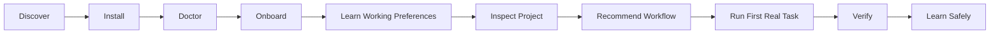
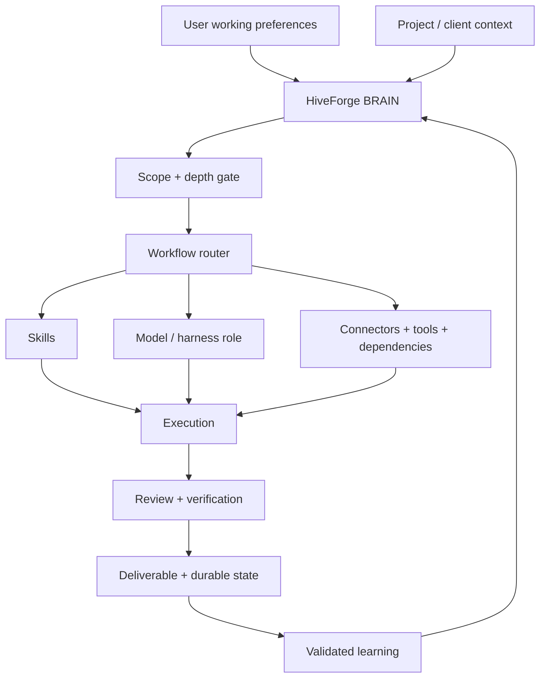
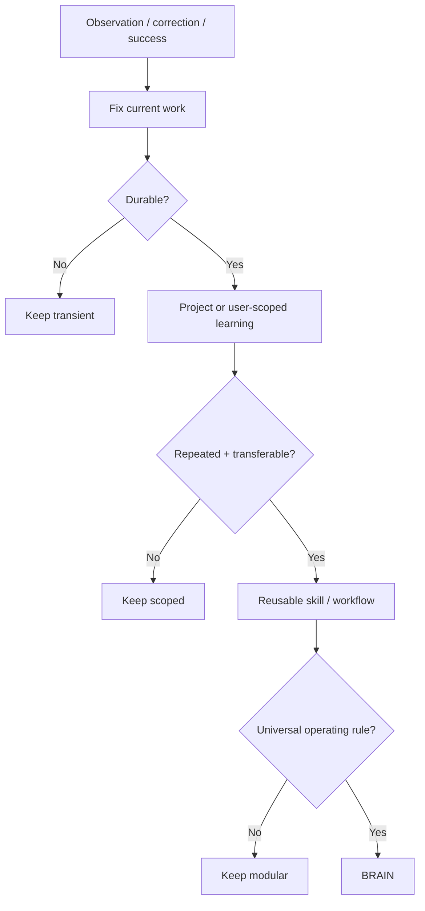
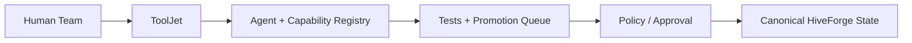

<div align="center">
  
</div>

<div align="center">

[](#release-status)
[](#release-status)
[](#architecture)
[](https://unparalleledsource.com)

# UNPS HiveForge

**Turn proven work into reusable intelligence—and reusable intelligence into deployable agents.**

[Start Here](docs/GETTING_STARTED.md) · [User Intake](docs/USER_INTAKE.md) · [Workflows](docs/WORKFLOW_GUIDE.md) · [Commands](docs/COMMAND_REFERENCE.md) · [Tools](docs/TOOLING_GUIDE.md) · [ToolJet](docs/TOOLJET_SETUP.md) · [Architecture](docs/ARCHITECTURE.md) · [Troubleshooting](docs/TROUBLESHOOTING.md) · [Security](SECURITY.md)

</div>

---

## What is HiveForge?

**HiveForge is a portable agent operating system** for turning prompts, skills, workflows, tools, evidence, project state, and validated learning into dependable agent behavior.

It is designed for both first-time users and experienced operators. HiveForge helps an agent determine:

- what the user is trying to accomplish;
- what it should learn about the user's working preferences;
- which client/project/internal workspace owns the work;
- whether direct reasoning is enough or deeper research is required;
- where missing evidence can be retrieved;
- which workflow, skill, model, harness, connector, API, or CLI is appropriate;
- where files and durable state belong;
- how work should be verified;
- what is worth learning for next time—and at what scope.

HiveForge is **not** one giant system prompt and is **not** tied to one model vendor, IDE, agent harness, memory product, or tool provider.

## New here? Use this path



### 1. Install

```bash
HIVEFORGE_REF=v0.6.0 \
  curl -fsSL https://raw.githubusercontent.com/Bigper4mer/UnparalleledSource/v0.6.0/install.sh | sh
```

### 2. Verify

```bash
hiveforge doctor
hiveforge version
```

### 3. Start the guided intake

```bash
hiveforge onboard
```

Copy the printed prompt into the AI environment where HiveForge is loaded.

### 4. Optional human-readable working profile

```bash
hiveforge profile-init
```

Default location:

```text
~/.config/unps-hiveforge/USER_PROFILE.md
```

### 5. Optional project intake

If the project does not already have a good README/status/ADR/source-of-truth system:

```bash
hiveforge project-init
```

HiveForge intentionally refuses to overwrite existing profile/project files.

### 6. Open the local Command Center

```bash
hiveforge dashboard
```

Full onboarding: **[Getting Started](docs/GETTING_STARTED.md)**

## First-run prompt

You can also copy this directly:

```text
I just installed UNPS HiveForge. Run the recommended startup intake before substantive work.

Learn only durable information useful for working with me: my role, goals, experience level by relevant domain, common work, preferred communication/detail level, tools I actually use, file/project conventions, and how much autonomy I want you to use.

Then inspect the current project/workspace, identify its source of truth, and recommend the smallest useful HiveForge workflow for my first real task.

Keep durable user preferences and project/client facts separate and human-readable. Do not store passwords, API keys, auth tokens, regulated data, or unrelated sensitive personal information in reusable profiles or learning files.

Retrieve authorized missing evidence yourself when an available source can resolve it. Explain what you learned and let me correct it before treating it as durable context.
```

Reusable file: [examples/FIRST_RUN_PROMPT.md](examples/FIRST_RUN_PROMPT.md)

## Guided, working, and expert users

| Mode | HiveForge behavior |
|---|---|
| **Guided** | Explains jargon, gives exact commands, uses safe defaults, shows what happens next |
| **Working** | Concise recommendations, sensible defaults, important trade-offs, efficient bounded execution |
| **Expert** | Exposes architecture, evidence, commands, fallbacks, costs, maturity states and verification gates |

Experience is **domain-specific**. A senior engineer can still request Guided mode for procurement, legal-document workflows, or unfamiliar research tasks.

## Recommended inputs

Users do not need to master prompt engineering. A strong request usually contains:

```text
GOAL
CURRENT CONTEXT / SOURCE OF TRUTH
CONSTRAINTS
DESIRED OUTPUT
DEFINITION OF DONE
```

Example:

```text
Goal: prepare this repository for a public release.
Context: use the current repository as the source of truth.
Constraints: do not expose client data; optional dependencies remain optional.
Output: tested release branch and concise release report.
Done: CI green on Linux/macOS/WSL, dashboard and fallback tests pass, release artifact has a checksum.
```

HiveForge should retrieve authorized missing evidence itself rather than forcing users to re-enter information already available in connected sources.

## Architecture



Detailed architecture: [docs/ARCHITECTURE.md](docs/ARCHITECTURE.md)

## Context model

```text
USER
├── role and goals
├── experience by domain
├── explanation/detail preference
├── tools actually used
├── file/naming preferences
└── autonomy/approval preferences

PROJECT
├── client / Internal scope
├── source of truth
├── status
├── decisions
├── findings
└── project learning

TASK
├── goal
├── required depth
├── workflow
├── evidence
├── tools
└── verification
```

This separation prevents project/client facts from leaking into global user behavior and prevents one-off preferences from polluting every future task.

## How HiveForge learns



Learning rule:

```text
task → project → user/account → reusable workflow/skill → BRAIN
```

A hidden/vector memory system may accelerate retrieval, but durable important knowledge must remain reconstructable by a human.

## Workflow selector

For consequential work:


Do not force this entire lifecycle onto trivial work.

| Need | Recommended mode |
|---|---|
| Explore options without changing anything | `/brainstorm` |
| Define the solution precisely | `/spec` |
| Break settled work into bounded slices | `/tickets` |
| Sequence execution | `/plan` |
| Execute approved work | `/implement` |
| Independently critique the result | `/review` |
| Prove completion | `/verify` |
| Research current/uncertain information | `/research` |
| Improve repository onboarding | `/readme` |
| Choose/render the right system view | `/diagram` |
| Extract reusable lessons | `/retro` |

Detailed input recipes and examples: [docs/WORKFLOW_GUIDE.md](docs/WORKFLOW_GUIDE.md)

## Commands

### Getting started

```text
hiveforge onboard               print the first-run copy/paste workflow
hiveforge docs                  show installed documentation paths
hiveforge profile-init [PATH]   create a human-readable user working profile
hiveforge project-init [PATH]   create an optional project-intake file
```

### Core runtime

```text
hiveforge doctor                validate package + onboarding assets
hiveforge bootstrap             print startup paths and boot sequence
hiveforge dashboard             launch the localhost Command Center
hiveforge run                   wrap a command with telemetry
hiveforge status                show current/recent run state
hiveforge start                 start an externally instrumented run
hiveforge event                 record safe phase/progress metadata
hiveforge finish                complete/fail a run
hiveforge approval              request an operator decision
hiveforge decide                approve/deny a pending decision
hiveforge connector             report connector health
```

### Optional ToolJet cockpit

```text
hiveforge tooljet status
hiveforge tooljet config
hiveforge tooljet up
hiveforge tooljet url
hiveforge tooljet down
```

### Utility

```text
hiveforge path
hiveforge version
hiveforge help
```

Full syntax: [docs/COMMAND_REFERENCE.md](docs/COMMAND_REFERENCE.md)

## Local Command Center

```bash
hiveforge dashboard
```

Instrument a command:

```bash
hiveforge run --task "Repository tests" -- npm test
```

The local dashboard binds to `127.0.0.1`, shows safe execution telemetry, and does **not** store prompt bodies, command output, secrets, or arbitrary environment variables.

See [docs/COMMAND_CENTER.md](docs/COMMAND_CENTER.md).

## Tool and capability routing

HiveForge separates capability availability from maturity.

| Capability | State | Primary use |
|---|---|---|
| Google Workspace | CORE | Authorized Drive/Gmail/Calendar/Contacts context |
| GitHub / Git | CORE | Repository source, PRs, issues and changes |
| Firecrawl | CORE/AVAILABLE | Structured web acquisition |
| Graphify `0.9.48` | CANDIDATE | Repository architecture and impact analysis |
| Only-CLI `@only-cli/oc` | CANDIDATE | Compact known-page retrieval |
| yt-dlp | CANDIDATE | Authorized media metadata/captions/media |
| youtube-dl | REFERENCE | Historical compatibility only |
| Composio | STAGED | External app action/tool layer |
| LangGraph | STAGED | Durable resumable orchestration |
| ToolJet | STAGED | Shared human-facing Agent & Capability Registry |

Full guide: [docs/TOOLING_GUIDE.md](docs/TOOLING_GUIDE.md)

## Repository intelligence with Graphify

For non-trivial repositories:

```text
project instructions
    ↓
Graphify report/query/path/explain
    ↓
exact implicated source
    ↓
tests/runtime evidence
```

Install candidate:

```bash
python3 -m pip install graphifyy==0.9.48
graphify .
graphify cluster-only .
```

Graphify is optional. If unavailable, HiveForge must use a capability-equivalent repository search/indexing path instead of blocking the task.

## Optional ToolJet team cockpit

For solo users, the built-in Command Center is enough.

For teams needing a shared visual control surface:



Local evaluation:

```bash
hiveforge tooljet config
hiveforge tooljet up
hiveforge tooljet url
```

Default URL:

```text
http://localhost:8080
```

ToolJet remains a **STAGED presentation/control surface**. BRAIN, authorization policy, canonical Markdown/project state, and promotion evidence remain authoritative outside page-level UI logic.

Full setup: [docs/TOOLJET_SETUP.md](docs/TOOLJET_SETUP.md)

## Package contract

A production HiveForge agent contains or references:

| File | Responsibility |
|---|---|
| `BRAIN.md` | Portable orchestration, retrieval, user-context and learning contract |
| `AGENT.md` | Identity, mission and scope |
| `SYSTEM_INSTRUCTIONS.md` | Persistent operating policy |
| `PACKAGE_MANIFEST.md` | Startup set and canonical references |
| `SKILLS.md` | Task-to-capability routing |
| `WORKFLOWS.md` | Ordered operating procedures |
| `MCP_PREFERENCES.md` | Connector selection and fallback order |
| `DEPENDENCIES.md` | Required and optional runtime capabilities |
| `OUTPUT_SCHEMAS.md` | Repeatable deliverable contracts |
| `TOOL_POLICY.md` | Authorization and mutation boundaries |
| `INSTALL.md` | Deployment and validation |
| `CHANGELOG.md` | Material version history |

## Production validation

HiveForge v0.6.0 adds guided onboarding on top of the v0.5.0 hardened control plane. The release gate covers:

- package/version/status consistency;
- public/private boundary and secret scanning;
- onboarding documentation integrity and safety boundaries;
- executable `onboard`, `docs`, `profile-init`, and `project-init` behavior;
- no-overwrite safeguards for user/project templates;
- ToolJet Docker Compose validation;
- Linux and macOS fresh installs;
- WSL/Ubuntu fresh install;
- dashboard health smoke test;
- live Graphify `0.9.48` extraction + clustering;
- fallback without Graphify;
- package export/import round trips;
- recorded production acceptance evidence.

## Repository layout

```text
00_README/                          governance, index and bootstrap
03_SKILLS/                          reusable capabilities
04_MCP_CONNECTORS/                  connector and model/harness routing
05_WORKFLOWS/                       control-plane and workspace workflows
06_DEPENDENCIES/                    dependency maturity and optional capabilities
09_TESTS_EVALS/                     acceptance and regression gates
10_CUSTOM_AGENTS/UNPS_HiveForge/    production agent package
assets/                             branded README imagery
bin/                                HiveForge CLI launcher
dashboard/                          local Command Center + telemetry runtime
docs/                               onboarding, workflows, commands, tools, architecture
examples/                           first-run, user-profile and project-intake templates
tooljet/                            optional STAGED ToolJet evaluation stack
schemas/                            machine-readable package contract
scripts/                            production/release tooling
tests/                              install, onboarding, Graphify, dashboard, fallback tests
install.sh                          one-command installer
```

## Operating principles

1. **Inspect before creating.** Search existing state first.
2. **Reference before copying.** Keep reusable intelligence canonical.
3. **Load progressively.** Every context asset must justify its cost.
4. **Retrieve before guessing.** Missing evidence is a retrieval problem first.
5. **Verify before claiming completion.** Evidence outranks confidence.
6. **Learn at the correct scope.** Do not globalize one-off corrections.
7. **Keep humans in the map.** Durable state must remain understandable without hidden memory.
8. **Keep optional tools optional.** Availability is not automatic promotion.

## Release status

**Current release:** `0.6.0`  
**Current maturity:** Production

HiveForge v0.6.0 is the guided-onboarding production baseline. Material behavioral changes require a new version and fresh release-gate cycle. Optional integrations retain independent maturity states.

## Public/private boundary

This public repository documents the framework and safe examples. It does not publish client/opportunity data, private correspondence, credentials, tokens, regulated records, private connector exports, or hidden operational memory.

Read [SECURITY.md](SECURITY.md) before contributing an integration or agent package.

## License

Copyright © 2026 Unparalleled Source. The repository is publicly viewable, but no permission to copy, modify, redistribute, sublicense, or commercially exploit the code or content is granted except by a separate written license. See [LICENSE](LICENSE).

---

<div align="center">

### Unparalleled Source

**Reusable intelligence. Portable agents. Verified execution.**

[unparalleledsource.com](https://unparalleledsource.com)

</div>
