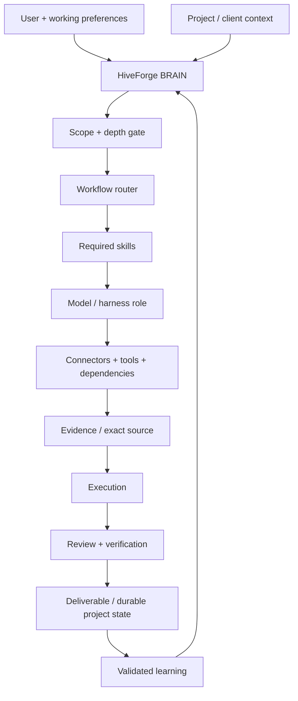
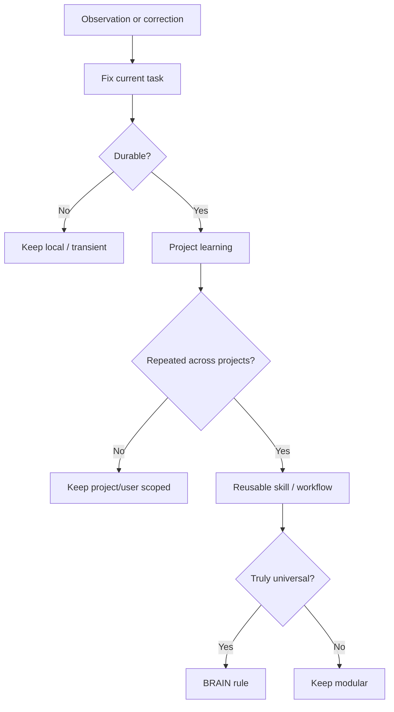

<div align="center">
  
</div>

<div align="center">

[](#release-status)
[](#release-status)
[](#architecture)
[](https://unparalleledsource.com)

**Turn proven work into reusable intelligence—and reusable intelligence into deployable agents.**

[Start Here](docs/GETTING_STARTED.md) · [User Intake](docs/USER_INTAKE.md) · [Workflows](docs/WORKFLOW_GUIDE.md) · [Commands](docs/COMMAND_REFERENCE.md) · [Tools](docs/TOOLING_GUIDE.md) · [ToolJet](docs/TOOLJET_SETUP.md) · [Architecture](docs/ARCHITECTURE.md) · [Security](SECURITY.md)

</div>

---

## Meet HiveForge

**UNPS HiveForge** is a portable agent operating system for turning prompts, skills, workflows, tools, evidence, project state, and validated learning into dependable agent behavior.

HiveForge is not one giant system prompt and it is not tied to one model or coding tool. It is a context-efficient control plane that helps an agent know:

- what the user is actually trying to accomplish;
- how deeply it needs to reason or research;
- where missing evidence can be retrieved;
- which workflow, skill, model, harness or tool is appropriate;
- where project/client files belong;
- how to verify consequential work;
- what should be learned for next time—and at what scope.

The name fits the system:

- **Hive** — specialized agents share reusable intelligence without carrying the entire library.
- **Forge** — raw workflows are tested, refined, versioned, and hardened into dependable agent packages.

## New here? Start with this path

You do **not** need to understand every HiveForge capability before using it.


### 1. Install

```bash
HIVEFORGE_REF=v0.5.0 \
  curl -fsSL https://raw.githubusercontent.com/Bigper4mer/UnparalleledSource/v0.5.0/install.sh | sh
```

### 2. Verify

```bash
hiveforge doctor
hiveforge version
hiveforge bootstrap
```

### 3. Copy/paste your first HiveForge prompt

```text
I just installed UNPS HiveForge. Run the recommended startup intake before doing substantive work.

Learn only what is useful for working with me: my role, goals, experience level, common work, preferred communication/detail level, tools I use, where my project files live, and how much autonomy I want you to use.

Then inspect the current project/workspace, identify the source of truth, and recommend the best first HiveForge workflow.

Keep durable preferences and project state human-readable. Separate user-level preferences from project/client facts. Do not store passwords, API keys, secrets, regulated data, or sensitive personal information in reusable profile or learning files.

Before changing persistent files, show me the proposed profile/project structure if the destination or scope is uncertain.
```

Full onboarding: **[HiveForge Getting Started](docs/GETTING_STARTED.md)**  
Reusable prompt: **[First-Run Prompt](examples/FIRST_RUN_PROMPT.md)**

## For beginners and experts

| User | HiveForge behavior |
|---|---|
| Guided / inexperienced | Explain jargon, provide exact commands, use safe defaults, show what will happen next |
| Working user | Give concise recommendations, surface important trade-offs, execute bounded low-risk work efficiently |
| Expert / operator | Assume technical fluency, expose architecture, evidence, commands, fallbacks, costs and promotion gates |

Experience is domain-specific. A strong engineer can still ask HiveForge for guided procurement, research or document-production workflows.

## What it solves

| Without HiveForge | With HiveForge |
|---|---|
| Repeated prompts scattered across chats | Canonical, versioned reusable assets |
| Every agent loads every instruction | Progressive, task-specific context loading |
| Tool selection depends on habit | Explicit capability, maturity and fallback routing |
| Corrections disappear with the conversation | Scoped, testable continuous learning |
| Client/project files drift into random locations | Human-readable scope and file-routing gates |
| Agent builds are difficult to reproduce | Portable package manifests and install paths |
| Confidence substitutes for verification | Evidence, review and acceptance gates |

## HiveForge in action

<div align="center">
  
  <br>
  <sub><strong>Pursuit intelligence:</strong> source review, risk control, cost realism, and deadline awareness operating as one coordinated system.</sub>
</div>

<br>

<table>
  <tr>
    <td width="42%" valign="top">
      
    </td>
    <td width="58%" valign="middle">
      <h3>Source-grounded by design</h3>
      <p>HiveForge inspects evidence before it acts. It preserves authoritative originals, retrieves only the relevant source set, separates fact from inference, and verifies consequential outputs before promotion.</p>
      <p><strong>Inspect → route → execute → verify → learn.</strong></p>
    </td>
  </tr>
</table>

## Architecture



The detailed model is documented in [docs/ARCHITECTURE.md](docs/ARCHITECTURE.md).

## How HiveForge learns without becoming opaque

HiveForge learns progressively. A single correction should not rewrite the global brain.



Recommended human-readable profile template: [examples/USER_PROFILE_TEMPLATE.md](examples/USER_PROFILE_TEMPLATE.md)  
Project intake template: [examples/PROJECT_INTAKE_TEMPLATE.md](examples/PROJECT_INTAKE_TEMPLATE.md)

## Recommended workflow lifecycle

For consequential work:


Do not force the whole lifecycle on trivial tasks.

### Common workflow modes

| Need | Use |
|---|---|
| Explore options without changing anything | `/brainstorm` |
| Turn intent into a durable definition | `/spec` |
| Split settled work into bounded slices | `/tickets` |
| Sequence execution | `/plan` |
| Execute approved work | `/implement` |
| Critique independently | `/review` |
| Prove completion | `/verify` |
| Research current/uncertain information | `/research` |
| Improve repository onboarding | `/readme` |
| Select/render the right system view | `/diagram` |
| Extract reusable lessons | `/retro` |

See **[Recommended Workflows & Inputs](docs/WORKFLOW_GUIDE.md)** for detailed input recipes and starter prompts.

## What should I give HiveForge?

You do not need a perfect prompt. The strongest inputs usually contain:

```text
GOAL
CURRENT CONTEXT / SOURCE
CONSTRAINTS
DESIRED OUTPUT
DEFINITION OF DONE
```

Example:

```text
Goal: prepare this repository for a public release.
Context: use the current repo as source of truth.
Constraints: do not expose client data; optional dependencies must remain optional.
Output: tested release branch and concise release report.
Done: CI green on Linux/macOS/WSL, dashboard and fallback tests pass, immutable release artifact has checksum.
```

HiveForge should retrieve authorized missing evidence itself rather than making the user manually re-enter information that already exists in connected sources.

## Core design

HiveForge separates durable behavior into composable layers:

```text
BRAIN
├── Agent identity and system policy
├── User working preferences
├── Client / project routing
├── Package manifest
├── Workflow resolver
├── Skill resolver
├── Model and harness router
├── Connector and dependency policy
├── Evidence retrieval
├── Output schemas
├── Tool and safety policy
└── Tests, evaluations, and learning records
```

### Optimized startup

Only four package files belong in normal startup context:

```text
BRAIN.md
→ AGENT.md
→ SYSTEM_INSTRUCTIONS.md
→ PACKAGE_MANIFEST.md
```

Then load validated user/project context and only the workflow-specific assets the task requires.

## Agent package contract

A production HiveForge agent contains or references:

| File | Responsibility |
|---|---|
| `BRAIN.md` | Portable orchestration contract |
| `AGENT.md` | Identity, mission and scope |
| `SYSTEM_INSTRUCTIONS.md` | Persistent operating policy |
| `PACKAGE_MANIFEST.md` | Startup set and canonical references |
| `SKILLS.md` | Task-to-capability routing |
| `WORKFLOWS.md` | Ordered operating procedures |
| `MCP_PREFERENCES.md` | Connector selection and fallback order |
| `DEPENDENCIES.md` | Required and optional runtime capabilities |
| `OUTPUT_SCHEMAS.md` | Repeatable deliverable contracts |
| `TOOL_POLICY.md` | Authorization and mutation boundaries |
| `INSTALL.md` | Deployment and validation |
| `CHANGELOG.md` | Material version history |

## Commands

The installed launcher exposes:

```text
hiveforge
├── doctor       validate package files
├── bootstrap    print startup paths and load order
├── dashboard    launch localhost Command Center
├── run          wrap a command with telemetry
├── status       show current/recent runtime state
├── start        begin an externally instrumented run
├── event        record phase/progress
├── finish       complete/fail a run
├── approval     request operator approval
├── decide       approve/deny a pending decision
├── connector    report connector health
├── path         print installation path
├── version      print version
└── help         show command help
```

Full syntax and copy/paste examples: **[Command Reference](docs/COMMAND_REFERENCE.md)**

## Capability maturity and tools

HiveForge keeps optional technology separate from core behavior.

| Capability | State | Primary use |
|---|---|---|
| Google Workspace | CORE | Authorized Drive/Gmail/Calendar/Contacts context |
| GitHub / Git | CORE | Repository source, PRs, issues and changes |
| Firecrawl | CORE/available | Structured web acquisition |
| Graphify `0.9.48` | CANDIDATE | Repository architecture and impact analysis |
| Only-CLI `@only-cli/oc` | CANDIDATE | Compact known-page retrieval |
| yt-dlp | CANDIDATE | Public/authorized media metadata/captions/media |
| youtube-dl | REFERENCE | Historical compatibility only |
| Composio | STAGED | External app action/tool layer |
| LangGraph | STAGED | Durable resumable agent orchestration |
| ToolJet | STAGED | Shared human-facing Agent & Capability Registry |

Full routing and setup guidance: **[Tools & Capability Guide](docs/TOOLING_GUIDE.md)**

## Local Command Center

Launch:

```bash
hiveforge dashboard
```

Instrument a command:

```bash
hiveforge run --task "Repository tests" -- npm test
```

The Command Center binds to localhost, displays current status, elapsed time, heartbeats, recent runs, approvals and connector health, and stores sanitized operational metadata rather than prompt bodies or command output.

See [docs/COMMAND_CENTER.md](docs/COMMAND_CENTER.md).

## Optional ToolJet team cockpit

For solo or new users, the local Command Center is enough.

For teams that need shared visual governance, ToolJet can sit above the HiveForge registry:


Current upstream ToolJet local evaluation command:

```bash
docker run \
  --name tooljet \
  --restart unless-stopped \
  -p 80:80 \
  --platform linux/amd64 \
  -v tooljet_data:/var/lib/postgresql/13/main \
  tooljet/try:ee-lts-latest
```

Then open `http://localhost`.

For a real deployment, use ToolJet's supported LTS deployment path and keep HiveForge authorization/policy outside page JavaScript.

Full guide: **[ToolJet Setup for HiveForge](docs/TOOLJET_SETUP.md)**

## Immutable production install

```bash
HIVEFORGE_REF=v0.5.0 \
  curl -fsSL https://raw.githubusercontent.com/Bigper4mer/UnparalleledSource/v0.5.0/install.sh | sh
```

Then:

```bash
hiveforge doctor
hiveforge bootstrap
hiveforge dashboard
```

Release archives include `SHA256SUMS` so downloaded artifacts can be verified before use.

The installer uses no root privileges, validates all 13 package files, and refuses to overwrite an existing installation unless `--force` is explicitly supplied.

## Production validation

HiveForge v0.5.0 passed `.github/workflows/production-gate.yml` across:

- package, version and status consistency;
- public/private boundary and secret scanning;
- fresh Linux and macOS installs;
- fresh WSL/Ubuntu install on the Windows runner;
- dashboard health endpoint;
- Graphify v0.9.48 live fixture extraction and clustering;
- fallback behavior with Graphify absent;
- package export/import round trips on Linux and macOS;
- three-workflow acceptance evidence.

## Repository layout

```text
00_README/                          Governance, index, and bootstrap
03_SKILLS/                          Required reusable capabilities
04_MCP_CONNECTORS/                  Connector and model/harness routing
05_WORKFLOWS/                       Control-plane and workspace workflows
06_DEPENDENCIES/                    Dependency maturity and optional capabilities
09_TESTS_EVALS/                     Acceptance and regression gates
10_CUSTOM_AGENTS/UNPS_HiveForge/    Complete agent package
assets/                             Branded README imagery
bin/                                HiveForge launcher
dashboard/                          Local Command Center and telemetry runtime
docs/                               User, workflow, command, architecture and setup guides
examples/                           Intake/profile/prompt examples
schemas/                            Machine-readable package contract
scripts/                            Production/release tooling
tests/                              Portable smoke and round-trip tests
install.sh                          One-command installer
```

## Operating principles

1. **Inspect before creating.** Search for an established asset or workspace first.
2. **Reference before copying.** Shared intelligence stays canonical.
3. **Load progressively.** Every context asset must justify its cost.
4. **Retrieve before guessing.** Missing evidence is a retrieval problem first.
5. **Verify before promoting.** Tests and sources outrank confidence.
6. **Learn at the right scope.** Do not globalize a one-off correction.
7. **Keep humans in the map.** A competent teammate must be able to navigate the system without hidden memory.

## Documentation map

| Need | Start here |
|---|---|
| I have never used HiveForge | [Getting Started](docs/GETTING_STARTED.md) |
| I want HiveForge to learn my working preferences | [User Intake & Learning](docs/USER_INTAKE.md) |
| I need the right workflow | [Workflow Guide](docs/WORKFLOW_GUIDE.md) |
| I need exact CLI commands | [Command Reference](docs/COMMAND_REFERENCE.md) |
| I want to understand tools/dependencies | [Tooling Guide](docs/TOOLING_GUIDE.md) |
| I want the local dashboard | [Command Center](docs/COMMAND_CENTER.md) |
| I want a shared team cockpit | [ToolJet Setup](docs/TOOLJET_SETUP.md) |
| I want to understand internals | [Architecture](docs/ARCHITECTURE.md) |
| Something is security-sensitive | [Security](SECURITY.md) |

## Release status

**Current release:** `0.5.0`  
**Current maturity:** Production

HiveForge v0.5.0 is the tested Production baseline. Material behavioral changes require a new version and a fresh release-gate cycle. Optional integrations retain their independent maturity states.

## Public/private boundary

This public repository documents the framework and safe examples. It does not publish:

- client or opportunity data;
- private prompts or proprietary workflows;
- credentials, tokens or connection secrets;
- regulated or sensitive records;
- internal connector configurations;
- hidden operational memory.

Read [SECURITY.md](SECURITY.md) before contributing an integration or agent package.

## License

Copyright © 2026 Unparalleled Source. The repository is publicly viewable, but no permission to copy, modify, redistribute, sublicense, or commercially exploit the code or content is granted except by a separate written license. See [LICENSE](LICENSE).

---

<div align="center">

### Unparalleled Source

**Reusable intelligence. Portable agents. Verified execution.**

[unparalleledsource.com](https://unparalleledsource.com)

</div>
