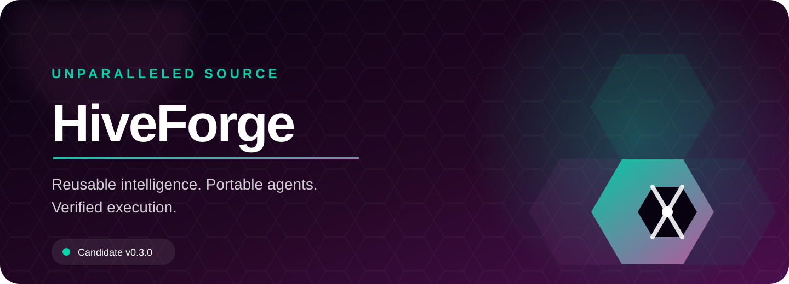
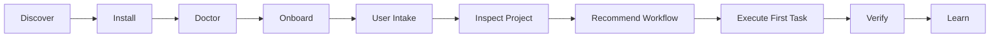
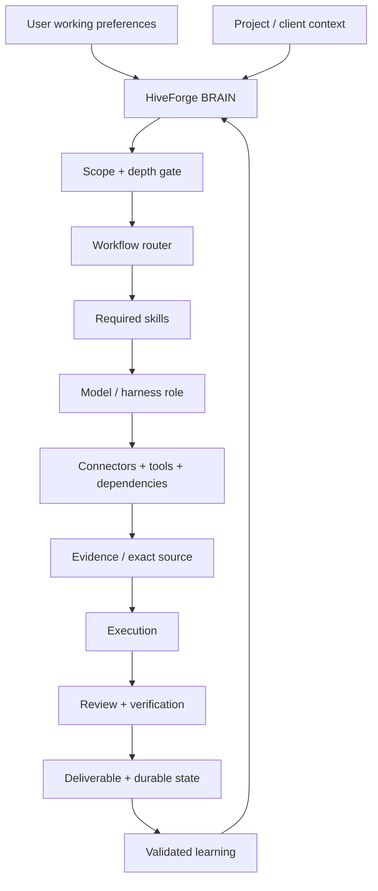
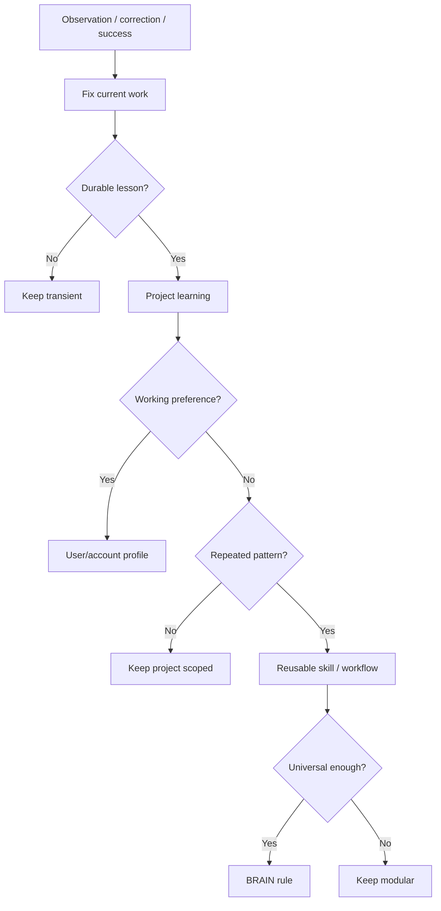
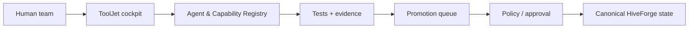

<div align="center">
  
</div>

<div align="center">

[](#release-status)
[](#guided-onboarding-preview)
[](#architecture)
[](https://unparalleledsource.com)

# UNPS HiveForge

**Turn proven work into reusable intelligence — and reusable intelligence into deployable agents.**

[Start Here](docs/GETTING_STARTED.md) · [User Intake](docs/USER_INTAKE.md) · [Workflows](docs/WORKFLOW_GUIDE.md) · [Commands](docs/COMMAND_REFERENCE.md) · [Tools](docs/TOOLING_GUIDE.md) · [ToolJet](docs/TOOLJET_SETUP.md) · [Architecture](docs/ARCHITECTURE.md) · [Troubleshooting](docs/TROUBLESHOOTING.md) · [Security](SECURITY.md)

</div>

---

## What is HiveForge?

**HiveForge is a portable agent operating system.** It gives an AI agent a human-readable control plane for deciding what to load, what to retrieve, which workflow to use, which tools to call, where files belong, how much reasoning is justified, how to verify its work, and what is worth learning for the future.

HiveForge is **not** one giant system prompt, one model, one coding harness, one vector database, or one proprietary memory layer. Its core is deliberately model-agnostic and tool-aware.

HiveForge helps an agent answer seven questions before acting:

1. **What is the user actually trying to accomplish?**
2. **Which user, client, project, or internal workspace owns this work?**
3. **Is direct reasoning enough, or should the agent retrieve evidence or escalate to deeper reasoning?**
4. **Which workflow, skills, model/harness role, connectors, and dependencies are justified?**
5. **What is the smallest reliable source set needed to execute?**
6. **What evidence proves the result is correct?**
7. **What should be remembered — and at what scope — so the same mistake or friction does not repeat?**

---

# Start here

You do **not** need to understand the architecture before using HiveForge.



## Stable production install — v0.5.0

```bash
HIVEFORGE_REF=v0.5.0 \
  curl -fsSL https://raw.githubusercontent.com/Bigper4mer/UnparalleledSource/v0.5.0/install.sh | sh
```

Then verify the installation:

```bash
hiveforge doctor
hiveforge version
hiveforge bootstrap
```

The stable v0.5.0 package is the hardened production control plane.

## Guided onboarding preview

The current onboarding branch is the candidate for **v0.6.0 — Guided Onboarding**. It adds first-run commands, human-readable profile/project templates, a complete workflow selector, expanded command documentation, and an optional ToolJet team cockpit.

For testing the guided onboarding branch:

```bash
HIVEFORGE_REF=docs/onboarding-experience \
  curl -fsSL https://raw.githubusercontent.com/Bigper4mer/UnparalleledSource/docs/onboarding-experience/install.sh \
  | sh -s -- --force
```

Then:

```bash
hiveforge doctor
hiveforge onboard
```

> Use the tagged v0.5.0 release for stable production installs until v0.6.0 completes its release gate.

---

# Your first 5 minutes

## 1. Verify HiveForge

```bash
hiveforge doctor
hiveforge version
```

## 2. Run the first-run intake

On the guided onboarding branch:

```bash
hiveforge onboard
```

That prints a safe copy/paste intake prompt for your AI environment.

Or use the prompt directly from [examples/FIRST_RUN_PROMPT.md](examples/FIRST_RUN_PROMPT.md).

### Copy/paste startup prompt

```text
I just installed UNPS HiveForge. Run the recommended startup intake before doing substantive work.

Learn only what is useful for working with me: my role, goals, domain experience, common work, preferred communication/detail level, tools I use, where project files normally live, and how much autonomy I want you to use.

Then inspect the current project/workspace, identify the source of truth, and recommend the smallest useful first HiveForge workflow.

Keep durable preferences and project state human-readable. Separate user-level working preferences from project/client facts. Do not store passwords, API keys, secrets, authentication material, regulated data, or unrelated sensitive personal information in reusable profiles or learning files.

Before changing persistent files, verify the client/project scope and established workspace. If routing is uncertain, show me the proposed destination instead of guessing.
```

## 3. Optionally create a human-readable user profile

```bash
hiveforge profile-init
```

Default location:

```text
~/.config/unps-hiveforge/USER_PROFILE.md
```

The profile is for **working preferences**, not hidden personal profiling. It should contain only information that materially improves collaboration.

## 4. Optionally initialize project intake

From a project directory:

```bash
hiveforge project-init
```

This creates:

```text
HIVEFORGE_PROJECT.md
```

Only use it when the repository does **not** already have a good README, status file, ADR structure, project index, or equivalent source-of-truth system.

## 5. Ask HiveForge to recommend the workflow

You do not need to memorize commands. A good first request is:

```text
Here is my goal, current source of truth, constraints, desired output, and definition of done. Inspect the project, recommend the smallest useful HiveForge workflow, identify any missing evidence you can retrieve yourself, and tell me what you need from me only if it cannot be resolved from available sources.
```

---

# Recommended inputs

You do not need a perfect prompt. The most useful input pattern is:

```text
GOAL
CURRENT CONTEXT / SOURCE OF TRUTH
CONSTRAINTS
DESIRED OUTPUT
DEFINITION OF DONE
```

Example:

```text
Goal:
Prepare this repository for public release.

Current context / source of truth:
Use the current repository and CI configuration.

Constraints:
Do not expose client data. Keep optional dependencies optional.

Desired output:
A tested release candidate with clear installation instructions.

Definition of done:
CI is green, install works, documentation is current, and the release artifact is reproducible.
```

HiveForge should retrieve authorized missing evidence itself whenever an available connected source can resolve it.

---

# User modes

HiveForge adapts to the user's experience **by domain**, not with one global skill label.

| Mode | Best for | HiveForge behavior |
|---|---|---|
| **Guided** | New or non-technical users | Explain jargon, provide exact commands, use safe defaults, show what happens next |
| **Working** | Regular operators | Be concise, recommend sensible defaults, surface material trade-offs |
| **Expert** | Technical/domain experts | Skip introductory explanations; expose architecture, evidence, commands, fallbacks, costs, and failure modes |

A user can be Expert in software engineering and Guided in federal procurement, finance, media production, or another domain.

See [User Intake](docs/USER_INTAKE.md).

---

# Recommended workflows

HiveForge uses the **minimum useful workflow** for the task.


Do not force this entire lifecycle onto trivial work.

| Need | Recommended mode | Typical output |
|---|---|---|
| Explore approaches | `/brainstorm` | options, risks, recommendation |
| Turn intent into durable requirements | `/spec` | implementation-ready specification |
| Split settled work into bounded slices | `/tickets` | independent executable tickets |
| Sequence execution | `/plan` | ordered implementation plan |
| Execute approved work | `/implement` | working artifact/code/change |
| Independently critique work | `/review` | findings by severity + fixes |
| Prove the result is done | `/verify` | test/evidence report |
| Investigate current or uncertain information | `/research` | source-grounded research synthesis |
| Improve repository onboarding | `/readme` | human-friendly project landing page |
| Select/render the right system view | `/diagram` | architecture/process/data visualization |
| Capture reusable lessons | `/retro` | scoped learning + regression guard |

Full guide with recommended inputs and prompts: **[WORKFLOW_GUIDE.md](docs/WORKFLOW_GUIDE.md)**

---

# Architecture



### Core principle

> **BRAIN decides. Human-readable files preserve durable state. Tools provide capabilities. Evidence verifies results. Optional infrastructure stays optional.**

Detailed architecture: **[ARCHITECTURE.md](docs/ARCHITECTURE.md)**

---

# How HiveForge learns

HiveForge is designed to improve with the user **without turning into an opaque or uncontrolled self-modifying agent**.



The promotion ladder is:

```text
task → project → user/account preference → reusable skill/workflow → BRAIN
```

A single correction normally does **not** become a global rule.

Recommended templates:

- [USER_PROFILE_TEMPLATE.md](examples/USER_PROFILE_TEMPLATE.md)
- [PROJECT_INTAKE_TEMPLATE.md](examples/PROJECT_INTAKE_TEMPLATE.md)

---

# Commands

## Guided onboarding commands — v0.6 candidate

```text
hiveforge
├── onboard                  print the first-run copy/paste intake workflow
├── docs                     show installed documentation paths
├── profile-init [PATH]      create a human-readable working profile
├── project-init [PATH]      create an optional project intake file
│
├── doctor                   validate the package + onboarding support files
├── bootstrap                print startup paths and load order
├── dashboard                launch the localhost Command Center
├── run                      run a command with telemetry
├── status                   show current/recent runtime state
├── start                    begin an externally instrumented run
├── event                    record progress
├── finish                   complete/fail a run
├── approval                 request operator approval
├── decide                   approve/deny a pending decision
├── connector                report connector health
│
├── tooljet status           explain ToolJet availability
├── tooljet up               start the local ToolJet evaluation stack
├── tooljet down             stop the local ToolJet evaluation stack
├── tooljet url              print the ToolJet URL
├── tooljet config           validate/show Compose configuration
│
├── path                     print installation directory
├── version                  print installed HiveForge version
└── help                     show help
```

Complete syntax, examples, and runtime instrumentation: **[COMMAND_REFERENCE.md](docs/COMMAND_REFERENCE.md)**

---

# Local Command Center

For solo users and local operations, HiveForge ships with a lightweight localhost dashboard.

```bash
hiveforge dashboard
```

Instrument any shell command:

```bash
hiveforge run --task "Repository tests" -- npm test
```

The dashboard shows:

- current run status;
- elapsed time;
- heartbeats;
- recent runs;
- pending approvals;
- connector health.

It intentionally does **not** store prompt bodies, command output, credentials, or arbitrary environment variables.

See [COMMAND_CENTER.md](docs/COMMAND_CENTER.md).

---

# ToolJet shared team cockpit

The local Command Center is sufficient for a single operator. For a team, HiveForge can optionally use ToolJet as a shared visual control surface.



ToolJet remains **STAGED**. It is a presentation and controlled-workflow layer — **not the BRAIN and not the canonical policy store**.

On the guided onboarding branch, inspect ToolJet status:

```bash
hiveforge tooljet status
```

With Docker + Compose v2 installed:

```bash
hiveforge tooljet up
hiveforge tooljet url
```

Default evaluation URL:

```text
http://localhost:8080
```

Stop it with:

```bash
hiveforge tooljet down
```

The eventual shared registry is designed to surface:

- Agents
- Capabilities
- Dependencies
- Tests & Evidence
- Promotion Queue
- Routing Simulator

Detailed setup and governance boundary: **[TOOLJET_SETUP.md](docs/TOOLJET_SETUP.md)**

---

# Tools and capability maturity

HiveForge does not install every possible tool globally. Capabilities are selected progressively and promoted independently.

| Capability | State | Primary role |
|---|---|---|
| Google Workspace | **CORE** | Authorized Drive/Gmail/Calendar/Contacts context |
| GitHub / Git | **CORE** | Repository source and operations |
| Firecrawl | **CORE / available** | Structured web acquisition |
| Graphify `0.9.48` | **CANDIDATE** | Repository graph, architecture, impact analysis |
| `@only-cli/oc` | **CANDIDATE** | Compact retrieval for known public text pages |
| `yt-dlp` | **CANDIDATE** | Public/authorized media metadata, subtitles and media |
| `youtube-dl` | **REFERENCE** | Historical compatibility only |
| Composio | **STAGED** | External-app action/tool layer |
| LangGraph | **STAGED** | Durable resumable orchestration |
| ToolJet | **STAGED** | Shared human operations cockpit |

Routing principle:

```text
local deterministic capability
→ native connected tool
→ approved existing dependency
→ candidate capability
→ discover new capability
→ security/license/cost/maintenance gate
→ pilot
→ promote only with evidence
```

See [TOOLING_GUIDE.md](docs/TOOLING_GUIDE.md).

---

# Repository intelligence with Graphify

Graphify is optional. For sufficiently complex repositories, HiveForge can use a repository graph to reduce broad source hydration.

```text
project instructions
→ Graphify graph/report
→ query/path/explain
→ exact implicated files
→ tests/runtime evidence
→ implementation
```

The tested candidate version is:

```text
graphifyy==0.9.48
```

HiveForge must still work when Graphify is unavailable.

---

# Package structure

```text
UNPS HiveForge
│
├── BRAIN.md                 orchestration contract
├── AGENT.md                 identity and mission
├── SYSTEM_INSTRUCTIONS.md   persistent behavior
├── PACKAGE_MANIFEST.md      startup and references
├── SKILLS.md                capability routing
├── WORKFLOWS.md             workflow routing
├── MCP_PREFERENCES.md       connector/tool preference policy
├── DEPENDENCIES.md          runtime and optional capabilities
├── OUTPUT_SCHEMAS.md        deliverable contracts
├── TOOL_POLICY.md           authorization and mutation boundaries
├── INSTALL.md               deployment instructions
└── CHANGELOG.md             material history
```

Optimized startup context:

```text
BRAIN.md
→ AGENT.md
→ SYSTEM_INSTRUCTIONS.md
→ PACKAGE_MANIFEST.md
→ validated user/project context
→ only the workflow-specific assets needed now
```

---

# Repository layout

```text
00_README/                          governance and bootstrap
03_SKILLS/                          reusable capabilities
04_MCP_CONNECTORS/                  connector + model/harness routing
05_WORKFLOWS/                       operational workflows
06_DEPENDENCIES/                    dependency maturity + optional tools
09_TESTS_EVALS/                     acceptance and regression gates
10_CUSTOM_AGENTS/UNPS_HiveForge/    deployable agent package
assets/                             branded README imagery
bin/                                HiveForge CLI launcher
dashboard/                          local Command Center
docs/                               user + operator documentation
examples/                           profile/project/first-run templates
tooljet/                            optional ToolJet evaluation stack
schemas/                            machine-readable contracts
scripts/                            production/release tooling
tests/                              smoke + cross-platform tests
install.sh                          non-root installer
```

---

# Production validation

HiveForge v0.5.0 passed the Production Gate across:

- package/version/status consistency;
- public/private boundary scanning;
- secret/private-key scanning;
- Linux fresh installation;
- macOS fresh installation;
- WSL/Ubuntu fresh installation;
- dashboard health smoke testing;
- Graphify `0.9.48` live extraction + clustering;
- fallback without Graphify;
- package export/import round trips;
- three materially different workflow acceptance scenarios.

The guided onboarding work is undergoing the same release-gate process before it becomes v0.6.0.

---

# Documentation map

| If you want to… | Read |
|---|---|
| Get running from zero | [GETTING_STARTED.md](docs/GETTING_STARTED.md) |
| Teach HiveForge how you work | [USER_INTAKE.md](docs/USER_INTAKE.md) |
| Choose the right workflow | [WORKFLOW_GUIDE.md](docs/WORKFLOW_GUIDE.md) |
| See every CLI command | [COMMAND_REFERENCE.md](docs/COMMAND_REFERENCE.md) |
| Understand tools and maturity | [TOOLING_GUIDE.md](docs/TOOLING_GUIDE.md) |
| Run the local dashboard | [COMMAND_CENTER.md](docs/COMMAND_CENTER.md) |
| Set up ToolJet | [TOOLJET_SETUP.md](docs/TOOLJET_SETUP.md) |
| Understand the control plane | [ARCHITECTURE.md](docs/ARCHITECTURE.md) |
| Fix a problem | [TROUBLESHOOTING.md](docs/TROUBLESHOOTING.md) |
| Understand security boundaries | [SECURITY.md](SECURITY.md) |

---

# Operating principles

1. **Inspect before creating.** Search for an established project, asset, or source of truth first.
2. **Retrieve before guessing.** Missing information is often a retrieval problem before it is a reasoning problem.
3. **Load progressively.** Every context asset must justify its cost.
4. **Reference before copying.** Shared intelligence stays canonical.
5. **Evidence outranks confidence.** Verify consequential work.
6. **Keep state human-readable.** A competent teammate should be able to understand the project without hidden memory.
7. **Learn at the narrowest useful scope.** Do not globalize one-off corrections.
8. **Optional infrastructure stays optional.** A branded dependency should not become a single point of failure.
9. **Human approval remains meaningful.** Consequential writes and promotions must respect policy boundaries.
10. **Grow through proven work.** Promote reusable behavior only after it demonstrates value.

---

# Release status

| Line | Status |
|---|---|
| **v0.5.0** | **Production — stable control plane** |
| **v0.6.0** | **Candidate — guided onboarding, user intake, workflow UX, expanded CLI, ToolJet evaluation path** |

Material behavioral changes require a new version and a fresh release-gate cycle.

---

# Security and privacy

The public repository intentionally excludes:

- client or opportunity workspaces;
- private correspondence;
- credentials, API keys, tokens, cookies, connector exports, or private keys;
- regulated or sensitive records;
- hidden operational memory;
- unrelated internal prompt-library assets.

User working profiles should contain only information needed to improve collaboration. They are **not** intended as unrestricted personal dossiers.

Read [SECURITY.md](SECURITY.md).

---

# License

Copyright © 2026 Unparalleled Source.

The repository is publicly viewable, but no permission to copy, modify, redistribute, sublicense, or commercially exploit the code or content is granted except by a separate written license.

See [LICENSE](LICENSE).

---

<div align="center">

### Unparalleled Source

**Reusable intelligence. Portable agents. Verified execution.**

[unparalleledsource.com](https://unparalleledsource.com)

</div>
