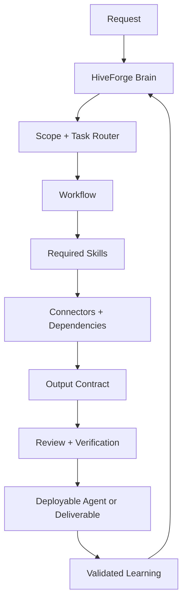

<div align="center">
  
</div>

<div align="center">

[](#release-status)
[](#release-status)
[](#architecture)
[](https://unparalleledsource.com)

**Turn proven work into reusable intelligence—and reusable intelligence into deployable agents.**

[Architecture](docs/ARCHITECTURE.md) · [Roadmap](docs/ROADMAP.md) · [Contributing](CONTRIBUTING.md) · [Security](SECURITY.md)

</div>

---

## Meet HiveForge

**UNPS HiveForge** is the public architecture and deployment framework for the Unparalleled Source agent engineering system. It organizes prompts, skills, workflows, connector policies, dependencies, output schemas, evaluations, and portable Custom Agent builds into one governed operating model.

The name fits the system:

- **Hive** — specialized agents share reusable intelligence without carrying the entire library.
- **Forge** — raw workflows are tested, refined, versioned, and hardened into dependable agent packages.

HiveForge is not a giant system prompt. It is a context-efficient control plane for building agents that know what to load, what to ignore, what to verify, and where durable work belongs.

## What it solves

| Without HiveForge | With HiveForge |
|---|---|
| Repeated prompts scattered across chats | Canonical, versioned reusable assets |
| Every agent loads every instruction | Progressive, task-specific context loading |
| Tool selection depends on habit | Explicit connector and cost routing |
| Corrections disappear with the conversation | Scoped, testable continuous learning |
| Agent builds are difficult to reproduce | Portable package manifests and install paths |
| Confidence substitutes for verification | Evidence, review, and acceptance gates |

## HiveForge in action

<div align="center">
  
  <br>
  <sub><strong>Pursuit intelligence:</strong> source review, risk control, cost realism, and deadline awareness operating as one coordinated system.</sub>
</div>

<br>

<table>
  <tr>
    <td width="42%" valign="top">
      
    </td>
    <td width="58%" valign="middle">
      <h3>Source-grounded by design</h3>
      <p>HiveForge inspects evidence before it acts. It preserves authoritative originals, retrieves only the relevant source set, separates fact from inference, and verifies consequential outputs before promotion.</p>
      <p><strong>Inspect → route → execute → verify → learn.</strong></p>
    </td>
  </tr>
</table>

## Architecture



The detailed model is documented in [docs/ARCHITECTURE.md](docs/ARCHITECTURE.md).

## Core design

HiveForge separates durable behavior into composable layers:

```text
BRAIN
├── Agent identity and system policy
├── Package manifest
├── Workflow resolver
├── Skill resolver
├── Model and harness router
├── Connector and dependency policy
├── Output schemas
├── Tool and safety policy
└── Tests, evaluations, and learning records
```

### Optimized startup

Only four files belong in the normal startup context:

```text
BRAIN.md
→ AGENT.md
→ SYSTEM_INSTRUCTIONS.md
→ PACKAGE_MANIFEST.md
```

Everything else loads only when the active workflow requires it.

## Agent package contract

A production-oriented HiveForge agent should contain or reference:

| File | Responsibility |
|---|---|
| `BRAIN.md` | Portable orchestration contract |
| `AGENT.md` | Identity, mission, and scope |
| `SYSTEM_INSTRUCTIONS.md` | Persistent operating policy |
| `PACKAGE_MANIFEST.md` | Startup set and canonical references |
| `SKILLS.md` | Task-to-capability routing |
| `WORKFLOWS.md` | Ordered operating procedures |
| `MCP_PREFERENCES.md` | Connector selection and fallback order |
| `DEPENDENCIES.md` | Required and optional runtime capabilities |
| `OUTPUT_SCHEMAS.md` | Repeatable deliverable contracts |
| `TOOL_POLICY.md` | Authorization and mutation boundaries |
| `INSTALL.md` | Deployment and validation |
| `CHANGELOG.md` | Material version history |

## Quick start

This repository now includes the complete public-safe HiveForge agent package and the shared files required to deploy it. The live UNPS Drive library remains canonical for internal operations and future synchronization.

### One-command install

```bash
curl -fsSL https://raw.githubusercontent.com/Bigper4mer/UnparalleledSource/main/install.sh | sh
```

Then print the ready-to-use agent boot sequence:

```bash
hiveforge bootstrap
```

The installer uses no root privileges, validates all 13 package files, and refuses to overwrite an existing installation unless `--force` is explicitly supplied.

1. Open the [complete HiveForge package](10_CUSTOM_AGENTS/UNPS_HiveForge/README.md).
2. Follow [INSTALL.md](10_CUSTOM_AGENTS/UNPS_HiveForge/INSTALL.md).
3. Load the four-file startup set.
4. Connect approved tools using least privilege.
5. Validate the build against [schemas/agent-package.schema.json](schemas/agent-package.schema.json).
6. Run the [acceptance evaluation](09_TESTS_EVALS/Prompt_Tests/PROMPT_DATABASE_AGENT_ACCEPTANCE_EVAL.md) before Production promotion.

## Repository layout

```text
00_README/                          Governance, index, and bootstrap
03_SKILLS/                          Required reusable capabilities
04_MCP_CONNECTORS/                  Connector and model/harness routing
05_WORKFLOWS/                       Control-plane and workspace workflows
06_DEPENDENCIES/                    Optional repository-intelligence capability
09_TESTS_EVALS/                     Acceptance and regression gates
10_CUSTOM_AGENTS/UNPS_HiveForge/    Complete 13-file agent package
assets/                             Branded README imagery
bin/                                HiveForge launcher
docs/                               Public architecture and roadmap
examples/                           Portable manifest example
schemas/                            Machine-readable package contract
install.sh                          One-command installer
```

See [DRIVE_SYNC_MANIFEST.md](DRIVE_SYNC_MANIFEST.md) for the published scope and source-of-truth policy.

## Operating principles

1. **Inspect before creating.** Search for an established asset or workspace first.
2. **Reference before copying.** Shared intelligence stays canonical.
3. **Load progressively.** Every context asset must justify its cost.
4. **Retrieve before guessing.** Missing evidence is a retrieval problem first.
5. **Verify before promoting.** Tests and sources outrank confidence.
6. **Learn at the right scope.** Do not globalize a one-off correction.
7. **Keep humans in the map.** A competent teammate must be able to navigate the system without hidden memory.

## Release status

**Current release:** `0.3.1`<br>
**Maturity:** Candidate

The framework is deployment-ready for controlled UNPS use. Production promotion remains gated on repeated acceptance passes across materially different workflows. Optional repository-intelligence integrations remain Candidate until their live promotion tests succeed.

See the [roadmap](docs/ROADMAP.md) for the next gates.

## Public/private boundary

This public repository documents the framework and safe examples. It does not publish:

- client or opportunity data;
- private prompts or proprietary workflows;
- credentials, tokens, or connection secrets;
- regulated or sensitive records;
- internal connector configurations;
- hidden operational memory.

Read [SECURITY.md](SECURITY.md) before contributing an integration or agent package.

---

<div align="center">

### Unparalleled Source

**Reusable intelligence. Portable agents. Verified execution.**

[unparalleledsource.com](https://unparalleledsource.com)

</div>
