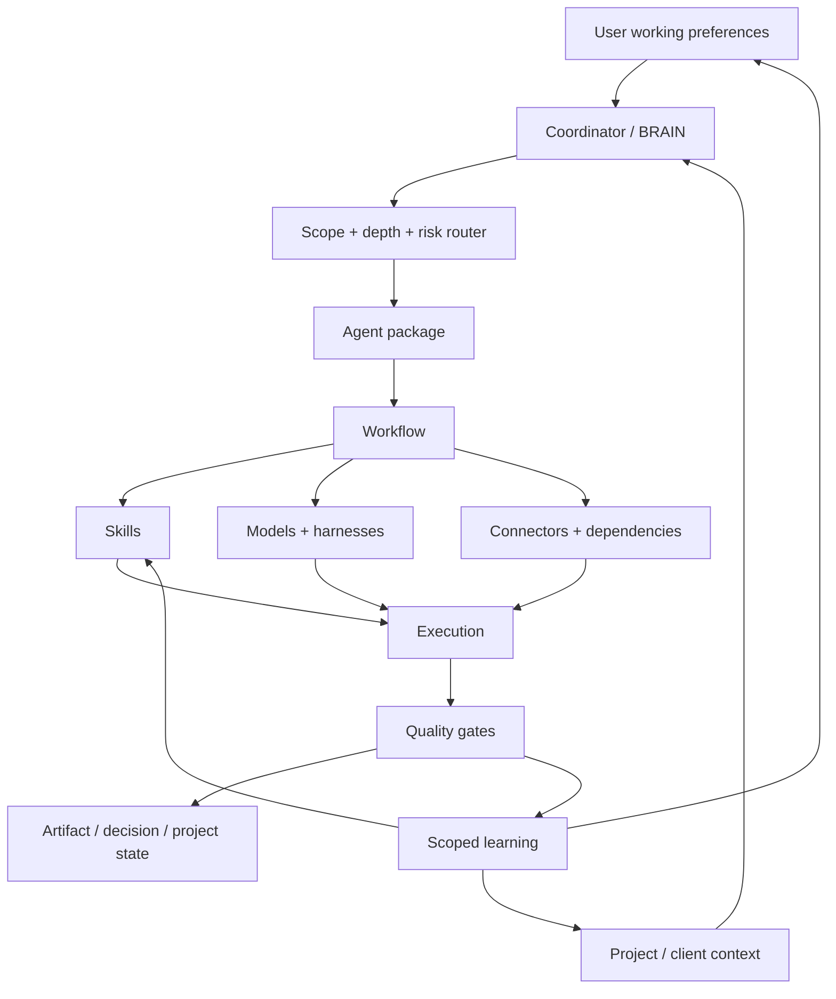
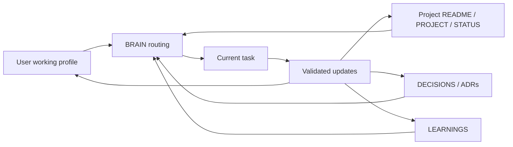
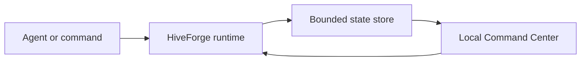
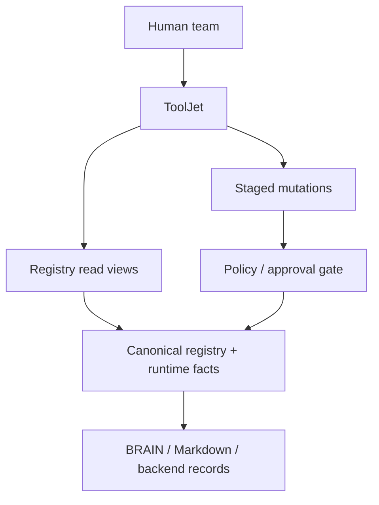
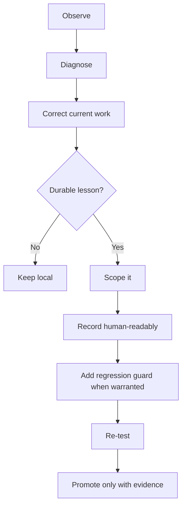

# HiveForge Architecture

## System boundary

HiveForge separates user/project context, orchestration, reusable intelligence, external capabilities, execution state and verification so each layer can change without rewriting the entire agent.



## Human-readable context model

HiveForge does not treat chat history or opaque model memory as the only map of a user or project.



User-level preferences and project/client facts remain separate. Existing project conventions should be reused instead of forcing `.hiveforge/` or another taxonomy into a healthy workspace.

## Layer model

| Layer | Owns | Must not own |
|---|---|---|
| User profile | Durable working preferences | Secrets, unrelated sensitive personal data, client facts |
| Project state | Scope, status, decisions, findings, project learning | Universal behavior rules |
| Brain | Durable orchestration and routing rules | Project-specific task state |
| Agent package | Identity, scope, package composition | Shared asset duplication |
| Workflow | Ordered execution and checkpoints | Hard-coded vendor assumptions |
| Skill | Reusable capability instructions | Transient client facts |
| Connector profile | Tool selection, permissions, fallbacks | Credentials |
| Dependency manifest | Runtime and optional requirements | Hidden installation side effects |
| Output schema | Deliverable structure and required evidence | Unsupported claims |
| Evaluation | Acceptance tests and regression guards | Self-certified confidence |
| Command Center | Sanitized run telemetry and operator approvals | Prompt content, credentials, authoritative business records |
| ToolJet cockpit | Shared visual registry/control surface | Canonical BRAIN or unrestricted direct mutations |

## Runtime observability

The built-in Command Center uses a dependency-free local runtime for immediate deployment. Instrumented commands and external agent hosts emit lifecycle events to a bounded JSON state store. The localhost dashboard reads that store and exposes session-token-protected approval decisions.



Lifecycle vocabulary includes:

```text
started
progress
heartbeat
approval requested
approval decided
completed
failed
```

## Shared operations with ToolJet

ToolJet can add a team-facing control surface without becoming the source of truth.



See [`TOOLJET_SETUP.md`](TOOLJET_SETUP.md).

## Progressive disclosure

HiveForge loads context in stages:

```text
BRAIN
→ agent identity/system policy/package manifest
→ validated user working preferences
→ project/client index and source of truth
→ applicable workflow
→ required skills
→ exact source sections
→ required connectors/dependencies
→ output schema
```

The agent should not hydrate the next layer until the task demonstrates a need for it.

## Evidence ladder

1. Authoritative project sources
2. Connected systems of record
3. Official or primary external sources
4. Specialized structured databases
5. Reputable secondary sources
6. Community evidence for sentiment and operating experience
7. Clearly labeled inference

## Cost ladder

1. Deterministic operation
2. Targeted retrieval
3. Fast worker
4. Specialist model
5. Deep reasoner
6. Coordinated multi-specialist workflow

Escalation is based on risk and expected quality improvement—not habit.

## Recommended workflow lifecycle


Use only the necessary portion for the task.

## Learning loop



Learning moves upward gradually:

```text
task
→ project
→ user/account
→ reusable skill/workflow
→ BRAIN only when truly universal
```

## User journey


See [`GETTING_STARTED.md`](GETTING_STARTED.md) for the full guided path.