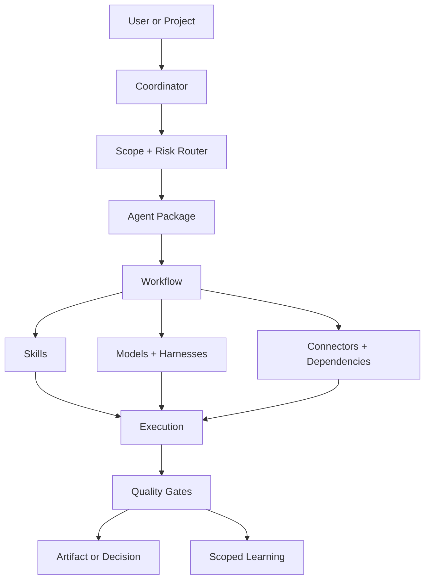
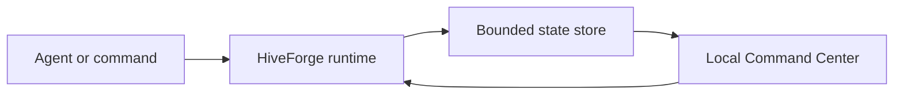

# HiveForge Architecture

## System boundary

HiveForge separates orchestration, reusable intelligence, external capabilities, execution state, and verification so each layer can change without rewriting the entire agent.



## Layer model

| Layer | Owns | Must not own |
|---|---|---|
| Brain | Durable orchestration and routing rules | Project-specific task state |
| Agent package | Identity, scope, package composition | Shared asset duplication |
| Workflow | Ordered execution and checkpoints | Hard-coded vendor assumptions |
| Skill | Reusable capability instructions | Transient client facts |
| Connector profile | Tool selection, permissions, fallbacks | Credentials |
| Dependency manifest | Runtime and optional requirements | Hidden installation side effects |
| Output schema | Deliverable structure and required evidence | Unsupported claims |
| Evaluation | Acceptance tests and regression guards | Self-certified confidence |
| Project state | Status, decisions, findings, progress | Global behavior rules |
| Command Center | Sanitized run telemetry and operator approvals | Prompt content, credentials, or authoritative business records |

## Runtime observability

The built-in Command Center uses a dependency-free local runtime for immediate
deployment. Instrumented commands and external agent hosts emit lifecycle events
to a bounded JSON state store. The localhost dashboard reads that store every two
seconds and exposes session-token-protected approval decisions.



This presentation layer can later be replaced by ToolJet and PostgreSQL without
changing the event vocabulary: started, progress, heartbeat, approval requested,
approval decided, completed, and failed.

## Progressive disclosure

HiveForge loads context in stages:

```text
Brain
→ agent identity
→ package manifest
→ project index
→ applicable workflow
→ required skills
→ exact source sections
→ connectors and dependencies
→ output schema
```

The agent should not hydrate the next layer until the current task demonstrates a need for it.

## Evidence ladder

1. Authoritative project sources
2. Connected systems of record
3. Official or primary external sources
4. Specialized structured databases
5. Reputable secondary sources
6. Community evidence for sentiment and operating experience
7. Clearly labeled inference

## Cost ladder

1. Deterministic operation
2. Targeted retrieval
3. Fast worker
4. Specialist model
5. Deep reasoner
6. Coordinated multi-specialist workflow

Escalation is based on risk and expected quality improvement—not habit.

## Learning loop

```text
observe
→ diagnose
→ correct current work
→ scope the lesson
→ record if durable
→ add a regression guard
→ re-test
→ promote only with evidence
```

Learning moves upward gradually:

`task → project → client/account → reusable UNPS asset → Brain`
