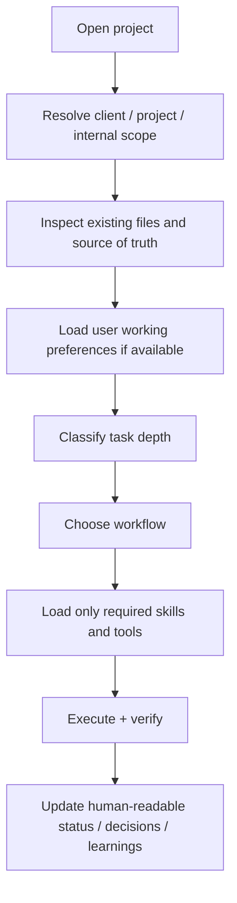

# HiveForge Getting Started

This guide takes a new user from discovering HiveForge to installing it, verifying the installation, introducing themselves to the agent, choosing a first workflow, and operating it safely.

> **Recommended for first-time users:** follow the **10-minute path** exactly once. After that, use the workflow and command references as needed.

## What HiveForge is

HiveForge is a model-agnostic agent operating system. It does not replace your AI model, coding harness, Drive, GitHub, or other tools. It gives an agent a portable set of rules for:

- understanding the task and how much reasoning it needs;
- finding missing evidence instead of guessing;
- selecting the smallest useful set of skills and tools;
- routing work into the correct client/project location;
- verifying important outputs;
- maintaining human-readable project state;
- learning from validated corrections without turning every one-off preference into a global rule.

## Choose your path

| User | Recommended path |
|---|---|
| New to agentic workflows | Install → `doctor` → read the intake prompt → run one guided task → inspect results |
| Comfortable with AI tools | Install → `bootstrap` → connect required tools → give a bounded project/task → review routing |
| Engineer / operator | Clone or install immutable release → inspect BRAIN/package manifest → wire preferred harness/connectors → use telemetry and tests |
| Team lead | Start with user intake + project intake → define canonical workspace → connect shared sources → establish review/approval boundaries |

## The 10-minute path

### 1. Install

For the released v0.5.0 package:

```bash
HIVEFORGE_REF=v0.5.0 \
  curl -fsSL https://raw.githubusercontent.com/Bigper4mer/UnparalleledSource/v0.5.0/install.sh | sh
```

If the `hiveforge` command is not on your PATH, the installer prints the direct launcher path.

### 2. Verify

```bash
hiveforge doctor
hiveforge version
hiveforge path
```

Expected version:

```text
0.5.0
```

`doctor` should report all required agent files present.

### 3. See the boot sequence

```bash
hiveforge bootstrap
```

HiveForge loads the compact startup set first:

```text
BRAIN.md
  → AGENT.md
  → SYSTEM_INSTRUCTIONS.md
  → PACKAGE_MANIFEST.md
  → task-specific workflow
  → only the required skills/tools/evidence
```

### 4. Give your agent the startup intake

Copy and paste this into the AI environment where you are using HiveForge:

```text
I just installed UNPS HiveForge. Run the recommended startup intake before doing substantive work.

Learn only what is useful for working with me: my role, goals, experience level, common work, preferred communication/detail level, tools I use, where my project files live, and how much autonomy I want you to use.

Then inspect the current project/workspace, identify the source of truth, and recommend the best first HiveForge workflow.

Keep durable preferences and project state human-readable. Separate user-level preferences from project/client facts. Do not store passwords, API keys, secrets, regulated data, or sensitive personal information in reusable profile or learning files.

Before changing any persistent files, show me the proposed profile/project structure and ask for approval if the destination or scope is uncertain.
```

A reusable version is in [`examples/FIRST_RUN_PROMPT.md`](../examples/FIRST_RUN_PROMPT.md).

### 5. Give HiveForge one real task

Good first tasks are bounded but meaningful. Examples:

```text
Inspect this project and tell me how it is organized, what the source of truth is, what appears incomplete, and what workflow you recommend next. Do not change anything yet.
```

```text
I need to research [topic]. Use current authoritative sources when needed, explain what changed, and give me a decision-ready summary. Save reusable research methods separately from project facts.
```

```text
Review this codebase before changing anything. Map the architecture, identify the smallest source set relevant to [problem], then propose an implementation plan and tests.
```

### 6. Watch a run

Run a command with HiveForge telemetry:

```bash
hiveforge run --task "My first HiveForge run" -- sh -c 'echo "HiveForge is running"'
```

Check state:

```bash
hiveforge status
hiveforge status --json
```

Open the local Command Center:

```bash
hiveforge dashboard
```

The dashboard binds to localhost and shows run state, elapsed time, approvals, and connector health.

## Recommended startup routine for every new project



Use this copy/paste project-start prompt:

```text
Use HiveForge project startup on this workspace.
1. Identify the project/client/internal scope.
2. Find the current source of truth and existing project instructions.
3. Summarize the current state in plain language.
4. Identify missing evidence or unclear ownership.
5. Recommend the smallest workflow and tool set for my goal.
6. Tell me what you will read or change before executing.
7. Preserve project decisions, status, and validated learnings in human-readable files.
Do not create duplicate roots or new taxonomy if a good structure already exists.
```

## How HiveForge learns you

HiveForge should learn progressively, not by building an opaque personality profile.

Recommended scopes:

```text
Session observation
      ↓
Project preference or fact
      ↓
User working preference
      ↓
Reusable capability / workflow learning
      ↓
Global BRAIN rule only when broadly proven
```

Examples of useful durable preferences:

- preferred response detail level;
- preferred output formats;
- recurring workflow types;
- primary tools/harnesses;
- naming and file-routing conventions;
- approval/autonomy preferences;
- repeated corrections that materially improve work.

Do **not** turn secrets, credentials, sensitive personal details, one-off exceptions, or client-specific facts into global memory.

See [`USER_INTAKE.md`](USER_INTAKE.md) and [`examples/USER_PROFILE_TEMPLATE.md`](../examples/USER_PROFILE_TEMPLATE.md).

## What to read next

- [User intake and learning](USER_INTAKE.md)
- [Recommended workflows and inputs](WORKFLOW_GUIDE.md)
- [Command reference](COMMAND_REFERENCE.md)
- [Tools and capability maturity](TOOLING_GUIDE.md)
- [Command Center](COMMAND_CENTER.md)
- [ToolJet Agent & Capability Registry](TOOLJET_SETUP.md)
- [Architecture](ARCHITECTURE.md)

## Beginner rule

You do not need to understand every skill, tool, model, connector, or dependency. Give HiveForge the goal, the workspace, and any important constraints. It should recommend the smallest useful path and explain consequential choices.

## Expert rule

Treat `BRAIN.md` as the portable control contract and all capabilities as replaceable implementations. Keep task context narrow, make state inspectable, and require evidence before Production promotion.