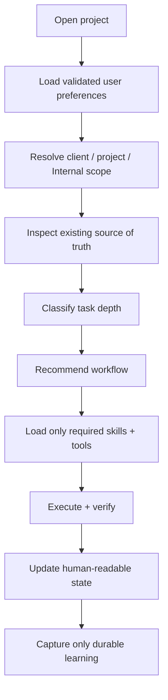

# HiveForge Getting Started

This guide takes a user from discovering HiveForge to installing it, verifying the installation, running the guided intake, choosing a first workflow, and operating it safely.

> **First-time users:** follow the 10-minute path once. Experienced operators can jump directly to `hiveforge docs`, `WORKFLOW_GUIDE.md`, or `COMMAND_REFERENCE.md`.

## What HiveForge is

HiveForge is a model-agnostic agent operating system. It does not replace your AI model, coding harness, Drive, GitHub, browser, or other tools. It gives an agent a portable contract for:

- understanding the user and the task at the right depth;
- finding missing evidence instead of guessing;
- selecting the smallest useful set of workflows, skills and tools;
- routing work into the correct client/project/internal location;
- verifying important outputs;
- maintaining human-readable project state;
- learning from validated corrections without turning every one-off preference into a global rule.

## Choose your path

| User | Recommended path |
|---|---|
| New to agentic workflows | Install → `doctor` → `onboard` → run one guided task → inspect results |
| Comfortable with AI tools | Install → `bootstrap` → `docs` → connect only required tools → run bounded work |
| Engineer / operator | Install immutable release → inspect BRAIN/package manifest → wire harness/connectors → use tests and telemetry |
| Team lead | Intake → define canonical workspace → establish approvals → use local Command Center → optionally stage ToolJet |

## The 10-minute path

### 1. Install

```bash
HIVEFORGE_REF=v0.6.0 \
  curl -fsSL https://raw.githubusercontent.com/Bigper4mer/UnparalleledSource/v0.6.0/install.sh | sh
```

If the `hiveforge` command is not on your PATH, the installer prints the direct launcher path.

### 2. Verify

```bash
hiveforge doctor
hiveforge version
hiveforge path
```

Expected version:

```text
0.6.0
```

### 3. Run guided onboarding

```bash
hiveforge onboard
```

This prints the recommended copy/paste prompt for the AI environment where HiveForge is loaded.

The intake should learn only durable information useful for work: role, goals, domain experience, detail preferences, tools actually used, file conventions, recurring workflows, and autonomy/approval preferences.

It should **not** store passwords, API keys, auth tokens, regulated data, unrelated sensitive personal information, temporary emotional state, or one-off project exceptions as reusable user context.

### 4. Optional human-readable profile

```bash
hiveforge profile-init
```

Default:

```text
~/.config/unps-hiveforge/USER_PROFILE.md
```

Review/correct the file before treating it as durable context. HiveForge will not overwrite an existing profile.

### 5. Inspect or initialize the project

First ask HiveForge to inspect the existing project. Do **not** create a parallel state system when a good README/status/ADR structure already exists.

If the project genuinely lacks a useful intake/source-of-truth file, you can explicitly create one:

```bash
hiveforge project-init
```

### 6. Give HiveForge one real task

Good first tasks are bounded but meaningful:

```text
Inspect this project and tell me how it is organized, what the source of truth is, what appears incomplete, and what workflow you recommend next. Do not change anything yet.
```

```text
Research [topic]. Use current authoritative sources when needed, explain what changed, and give me a decision-ready summary. Keep project facts separate from reusable research methodology.
```

```text
Review this codebase before changing anything. Map the architecture, identify the smallest source set relevant to [problem], then propose an implementation plan and tests.
```

### 7. Use telemetry when useful

```bash
hiveforge run --task "My first HiveForge run" -- sh -c 'echo "HiveForge is running"'
hiveforge status
hiveforge dashboard
```

The local Command Center shows safe run state, elapsed time, approvals and connector health.

## Recommended startup routine for every new project



Use this project-start prompt:

```text
Use HiveForge project startup on this workspace.
1. Load only relevant validated user working preferences.
2. Identify the project/client/Internal scope.
3. Find the current source of truth and existing project instructions.
4. Summarize the current state in plain language.
5. Identify missing evidence or unclear ownership.
6. Recommend the smallest workflow and tool set for my goal.
7. Tell me what you will read or change before executing.
8. Preserve project decisions, status and validated learnings in human-readable files.
Do not create duplicate roots or a competing taxonomy when a good structure already exists.
```

## How HiveForge learns you

HiveForge should learn progressively, not by building an opaque personality profile.

```text
session observation
      ↓
project-specific learning
      ↓
user working preference
      ↓
reusable workflow / skill
      ↓
BRAIN only when broadly proven
```

Useful durable user preferences include:

- preferred response detail level;
- preferred output formats;
- experience level by domain;
- primary tools/harnesses;
- naming and file-routing conventions;
- approval/autonomy preferences;
- recurring workflows;
- repeated corrections that materially improve future work.

Client/project facts remain project-scoped. Secrets and sensitive personal data do not become reusable profile data.

See [USER_INTAKE.md](USER_INTAKE.md) and [USER_PROFILE_TEMPLATE.md](../examples/USER_PROFILE_TEMPLATE.md).

## Recommended input recipe

You usually only need:

```text
GOAL
CURRENT CONTEXT / SOURCE OF TRUTH
CONSTRAINTS
DESIRED OUTPUT
DEFINITION OF DONE
```

HiveForge should retrieve authorized missing evidence itself when an available source can resolve it.

## What to read next

- [User intake and learning](USER_INTAKE.md)
- [Recommended workflows and inputs](WORKFLOW_GUIDE.md)
- [Command reference](COMMAND_REFERENCE.md)
- [Tools and capability maturity](TOOLING_GUIDE.md)
- [Command Center](COMMAND_CENTER.md)
- [ToolJet setup](TOOLJET_SETUP.md)
- [Architecture](ARCHITECTURE.md)
- [Troubleshooting](TROUBLESHOOTING.md)

## Optional ToolJet team cockpit

ToolJet is not required for core HiveForge.

```bash
hiveforge tooljet status
hiveforge tooljet config
hiveforge tooljet up
hiveforge tooljet url
```

Use it only when a shared team control surface materially helps. Canonical authorization, maturity, source-of-truth and learning remain outside page-level UI logic.

## Beginner rule

You do not need to understand every skill, model, connector or dependency. Give HiveForge your goal, workspace and important constraints. It should recommend the smallest useful path and explain consequential choices.

## Expert rule

Treat `BRAIN.md` as the portable control contract and capabilities as replaceable implementations. Keep context narrow, state inspectable and completion evidence-based.
