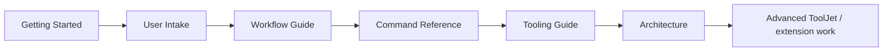

# HiveForge Documentation

Use this page as the documentation router for HiveForge v0.7.0.

## I am new to HiveForge

1. [Getting Started](GETTING_STARTED.md)
2. [User Intake & Learning](USER_INTAKE.md)
3. [Workflow Guide](WORKFLOW_GUIDE.md)
4. [Command Reference](COMMAND_REFERENCE.md)
5. [Troubleshooting](TROUBLESHOOTING.md)

Fast start:

```bash
hiveforge doctor
hiveforge onboard
```

## I want exact commands

- [Command Reference](COMMAND_REFERENCE.md)
- [Command Center](COMMAND_CENTER.md)
- [Install guide](../10_CUSTOM_AGENTS/UNPS_HiveForge/INSTALL.md)

## I want to understand how to prompt it

- [First-run prompt](../examples/FIRST_RUN_PROMPT.md)
- [Recommended workflows and inputs](WORKFLOW_GUIDE.md)
- [User profile template](../examples/USER_PROFILE_TEMPLATE.md)
- [Project intake template](../examples/PROJECT_INTAKE_TEMPLATE.md)

## I want to understand the system

- [Architecture](ARCHITECTURE.md)
- [Tools & capability maturity](TOOLING_GUIDE.md)
- [Security](../SECURITY.md)
- [v0.7.0 production evidence](../09_TESTS_EVALS/Prompt_Tests/PRODUCTION_ACCEPTANCE_MATRIX_v0.7.0.md)

## I want dashboards

### Local / solo

- [Command Center](COMMAND_CENTER.md)
- Start: `hiveforge dashboard`

### Shared / team

- [ToolJet Setup](TOOLJET_SETUP.md)
- Validate: `hiveforge tooljet config`
- Start evaluation: `hiveforge tooljet up`
- [ToolJet registry implementation contract](../05_WORKFLOWS/Agent_Control_Plane/TOOLJET_AGENT_CAPABILITY_REGISTRY.md)

## I am extending HiveForge

- [Architecture](ARCHITECTURE.md)
- [Roadmap](ROADMAP.md)
- [Contributing](../CONTRIBUTING.md)
- [Dependency status manifest](../06_DEPENDENCIES/DEPENDENCY_STATUS_MANIFEST.md)
- [Model/harness routing](../04_MCP_CONNECTORS/Models_Harnesses/MODEL_HARNESS_ROUTER.md)

## Release information

- [v0.7.0 release notes](RELEASE_NOTES_v0.7.0.md)
- [v0.6.0 release notes](RELEASE_NOTES_v0.6.0.md)
- [v0.5.0 release notes](RELEASE_NOTES_v0.5.0.md)
- [Drive/GitHub sync manifest](../DRIVE_SYNC_MANIFEST.md)

## Recommended learning order


