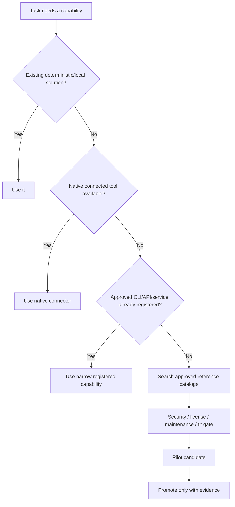

# HiveForge Tools & Capability Guide

HiveForge treats tools as capabilities with explicit maturity and routing rules. A tool being available does not mean it should be loaded or installed for every task.

## Capability states

| State | Meaning |
|---|---|
| **CORE** | Validated and approved for normal use |
| **CANDIDATE** | Integrated and useful, still accumulating broader validation |
| **STAGED** | Setup/research complete enough for a bounded pilot; not default runtime |
| **REFERENCE** | Discovery/reference source only |
| **RESTRICTED** | Explicitly justified/authorized use only |
| **DEPRECATED** | Retained for history/compatibility; avoid for new work |

Canonical maturity is maintained in `06_DEPENDENCIES/DEPENDENCY_STATUS_MANIFEST.md`.

## Recommended selection order



## Current capability map

### Connected data and repository operations

| Capability | Typical status | Use |
|---|---|---|
| Google Workspace connectors | CORE | Drive, Gmail, Calendar, Contacts and authorized Workspace context |
| GitHub connector / Git | CORE | Source, PRs, issues, repository changes and review |
| Firecrawl | CORE/available | Structured web acquisition when ordinary retrieval is insufficient |

### Repository intelligence

**Graphify** — Candidate

Use for architecture, blast radius, dependency tracing, migration/refactor analysis and unfamiliar multi-module codebases.

Current tested candidate:

```text
graphifyy==0.9.48
```

Typical local setup:

```bash
python3 -m pip install graphifyy==0.9.48
graphify --version
graphify .
graphify cluster-only .
```

Do not use Graphify for trivial single-file work. If unavailable, HiveForge must fall back to repository search and direct source inspection.

### Compact public-page retrieval

**Only-CLI (`@only-cli/oc`)** — Candidate

Install when this capability is needed:

```bash
npm install -g @only-cli/oc
```

Useful commands include:

```bash
oc open <url>
oc do <n>
oc find <query>
oc read <n>
oc next
oc raw <url>
```

Use it for known public, text-heavy pages when a compact representation is sufficient. Escalate to browser/crawl tooling for dynamic interaction, authentication, complex JavaScript, visual layout or site-wide extraction.

### Media ingestion

**yt-dlp** — Candidate / preferred current media CLI

**youtube-dl** — Reference / compatibility only

Recommended pattern:

```text
metadata
→ captions/subtitles
→ selected audio
→ selected video
→ full media only when necessary
```

Do not use media tooling to bypass DRM, paywalls, private accounts or access controls.

See `06_DEPENDENCIES/Python/CLI_Tools/Media_Ingestion/MEDIA_INGESTION_TOOLING.md`.

### External app actions

**Composio** — Staged

Use when a required external app is not adequately covered by a native approved connector, especially when session-scoped tool discovery can avoid loading huge tool catalogs.

TypeScript staging example:

```bash
npm install @composio/core @composio/openai-agents @openai/agents
```

Python staging example:

```bash
pip install composio composio-openai-agents openai-agents
```

Composio should be piloted with least privilege and explicit action approval before consequential writes.

### Durable orchestration

**LangGraph** — Staged

Use only when the workflow materially needs resumable state, checkpoints, human interrupts or long-running stateful execution.

Staging install:

```bash
pip install -U langgraph
```

Do not add LangGraph to bounded one-shot tasks that a simple script or agent turn can handle reliably.

### Human operations cockpit

**HiveForge Command Center** — Core optional interface

```bash
hiveforge dashboard
```

Use it for local run telemetry, approvals and connector state.

**ToolJet Agent & Capability Registry** — Staged advanced cockpit

Use it when a team needs a shared human-facing registry of agents, capabilities, dependencies, test evidence and promotion queues. ToolJet remains a presentation/control layer rather than the canonical BRAIN or business-record store.

See [`TOOLJET_SETUP.md`](TOOLJET_SETUP.md).

## Research/reference catalogs

HiveForge may use reference repositories and catalogs to discover candidates, but should not bulk-install them.

Examples include:

- public API catalogs;
- free-for-dev service catalogs;
- agent-skill registries;
- MARKTECHPOST agent implementation tutorials;
- design-tool indexes;
- prompt libraries;
- security/sysadmin reference collections.

Discovery must be followed by a fit, maintenance, license, privacy and security review.

## Capability recommendation language

HiveForge should tell the user when a tool would materially help, using a compact state label:

```text
✓ Connected
✓ Installed
◇ Available
◐ Candidate
⚗ Staged / Pilot
○ Reference only
⚠ Restricted
```

Examples:

```text
Useful next: Graphify (◐ Candidate) — this change crosses several modules and dependency tracing will reduce broad source loading.
```

```text
Better source: Google Drive (✓ Connected) — the answer appears to depend on your current project documents rather than public web information.
```

```text
Optional cockpit: ToolJet (⚗ Staged) — useful if multiple teammates need a shared visual capability registry; unnecessary for a single local user.
```

## Tool economy rule

Before adding a dependency, ask:

1. Does an existing/native capability already solve this?
2. Does the new tool materially improve quality, speed, reliability or context efficiency?
3. What permissions and data does it need?
4. How is it maintained and licensed?
5. Can the workflow continue safely when it is unavailable?
6. Is there a documented uninstall/rollback path?
7. Is the expected benefit worth ongoing maintenance?

If those answers are weak, keep the capability as reference or staged rather than making it core.