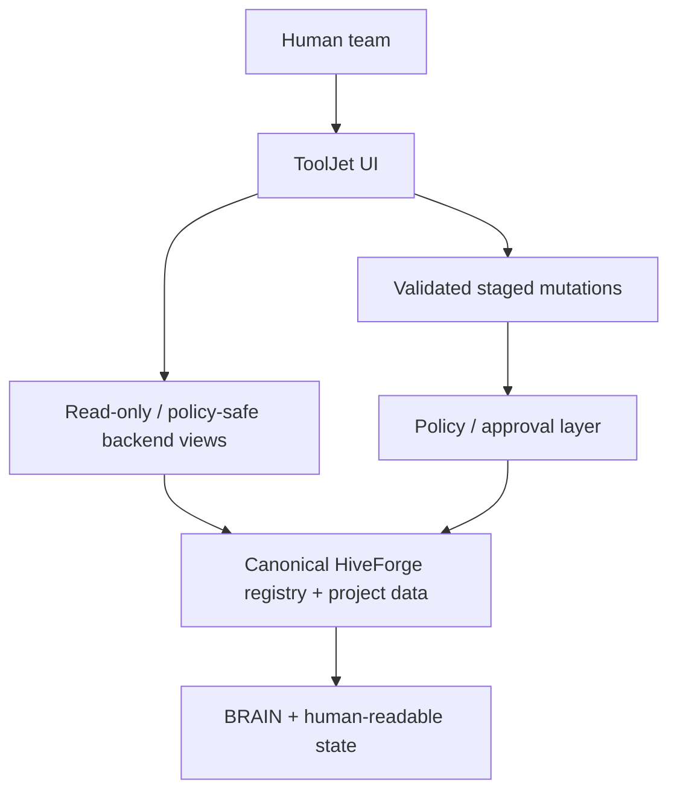

# ToolJet Setup for HiveForge

ToolJet is an **optional STAGED team cockpit** for organizations that want a shared visual interface over HiveForge agents, capabilities, dependencies, test evidence and promotion queues.

> New individual users do **not** need ToolJet. Start with the HiveForge CLI + local Command Center. Add ToolJet only when a shared operational UI materially helps.

## Architecture boundary



**ToolJet displays and controls. It does not replace BRAIN, canonical Markdown/project state, source repositories, Drive, or policy enforcement.**

## HiveForge local evaluation commands

The v0.7.0 package includes a STAGED Docker Compose evaluation stack.

Check status/help:

```bash
hiveforge tooljet status
```

Validate the Compose file without starting anything:

```bash
hiveforge tooljet config
```

Start:

```bash
hiveforge tooljet up
```

Print URL:

```bash
hiveforge tooljet url
```

Default:

```text
http://localhost:8080
```

Stop/remove the evaluation container:

```bash
hiveforge tooljet down
```

Requirements for `config`, `up`, and `down`:

- Docker
- Docker Compose v2 (`docker compose`)

The packaged evaluation file lives at:

```text
tooljet/docker-compose.yml
```

It uses ToolJet's LTS-oriented quick-evaluation image and a named local volume. Treat this as an evaluation path, not a finalized organizational deployment architecture.

## Direct upstream quick evaluation

If you are not using the HiveForge wrapper, ToolJet's upstream repository provides a Docker quickstart similar to:

```bash
docker run \
  --name tooljet \
  --restart unless-stopped \
  -p 80:80 \
  --platform linux/amd64 \
  -v tooljet_data:/var/lib/postgresql/13/main \
  tooljet/try:ee-lts-latest
```

For shared Production use, follow ToolJet's supported deployment documentation and prefer an LTS release.

Upstream project: `ToolJet/ToolJet`

## HiveForge registry implementation

Canonical implementation contract:

```text
05_WORKFLOWS/Agent_Control_Plane/TOOLJET_AGENT_CAPABILITY_REGISTRY.md
```

Minimum UI:

1. **Agents**
2. **Capabilities**
3. **Dependencies**
4. **Tests & Evidence**
5. **Promotion Queue**
6. **Routing Simulator**

## Recommended backend model

Do not have ToolJet parse and rewrite arbitrary Markdown directly from browser JavaScript.

Recommended flow:

```text
HiveForge Markdown / approved runtime facts
        ↓
registry compiler or synchronization service
        ↓
normalized backend tables/views
        ↓
ToolJet read queries
        ↓
staged status/test/mapping requests
        ↓
validated backend functions
        ↓
review / approval
        ↓
canonical update
```

## Data sources

Create separate data sources/credential roles where possible:

| Data source | Recommended privilege | Purpose |
|---|---|---|
| Registry read database/API | Read-only | Agents, capabilities, tests, status |
| Registry mutation functions/API | Execute-only / scoped writes | Stage changes and approvals |
| Source/document API | Scoped | Link to canonical evidence |
| Object storage | Short-lived URLs only | Controlled upload/download when required |

Do not expose database-owner credentials, permanent storage keys, provider secrets or broad API keys in page JavaScript, browser storage or exported app definitions.

## Query naming

```text
get_*      read
stage_*    create a proposed/staged change
approve_*  approval action
do_*       validated operation
```

Recommended reads:

```text
get_registry_health
get_agents
get_capabilities
get_agent_capability_matrix
get_dependency_tests
get_promotion_queue
get_capability_detail
get_routing_simulation
```

Recommended controlled writes:

```text
stage_capability_status_change
stage_dependency_test_result
stage_agent_capability_change
approve_capability_promotion
do_refresh_registry
```

## Build order

### Phase 1 — Registry viewer

Build only:

- health cards;
- Agents tab;
- Capabilities tab;
- maturity filters;
- canonical-source links;
- last-validation timestamps.

Do this before mutations.

### Phase 2 — Evidence and dependencies

Add:

- Dependencies tab;
- Tests & Evidence;
- blocked/failed/stale states;
- last-good snapshot;
- data freshness indicators.

### Phase 3 — Promotion workflow

Add staged changes and reviewer approval.

A user should **never** be able to change `CANDIDATE → CORE` merely by editing a displayed value. Promotion requires backend policy and evidence.

### Phase 4 — Routing Simulator

Let a user enter a task class and see:

```text
recommended agent
→ workflow
→ skills
→ tools
→ maturity
→ fallback
```

The simulator is explanatory; it should not execute the selected tools automatically.

## Suggested roles

| Role | Access |
|---|---|
| Viewer | Read registry/evidence |
| Operator | Refresh and stage test/status changes |
| Reviewer | Approve promotion after gates pass |
| Admin | Manage integrations/mappings |

UI hiding is not authorization. Enforce roles server-side.

## Acceptance checklist before ToolJet becomes CORE

- [ ] every seeded agent renders;
- [ ] every capability has maturity and canonical source;
- [ ] agent→capability relationships are correct;
- [ ] filters work;
- [ ] stale, blocked and failed tests are distinct;
- [ ] unauthorized promotion is rejected server-side;
- [ ] authorized reviewer can approve a staged request;
- [ ] registry refresh cannot overwrite canonical policy directly;
- [ ] backend outage returns stale/last-good state, not false success;
- [ ] routing simulator explains a path without executing it;
- [ ] no credentials appear in page JS, browser storage, exports or logs.

## Different users

### Beginner / solo

Use:

```text
HiveForge CLI
+ local Command Center
```

Skip ToolJet initially.

### Power user

Use ToolJet when you want a visual capability catalog and promotion queue across several projects or agents.

### Team / organization

ToolJet becomes valuable when multiple people need shared visibility, role-aware review, capability status and evidence.

## Production note

ToolJet Community Edition and ToolJet AI/Enterprise have different feature sets. Confirm that required RBAC depth, GitSync, multi-environment management, AI Agent Builder, white labeling or other enterprise controls exist in the edition you plan to deploy before making them a HiveForge Production requirement.
