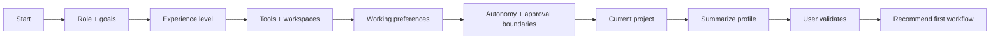

# HiveForge User Intake & Learning

The startup intake helps HiveForge work effectively with a new user without collecting unnecessary information or hiding important context in opaque memory.

## Intake goal

At the end of intake, HiveForge should know enough to answer five questions:

1. **Who is the user in this work context?**
2. **What are they trying to accomplish?**
3. **How experienced are they with this type of work and tooling?**
4. **Where does authoritative project information live?**
5. **How should the agent communicate, act, and ask for approval?**

Anything beyond that should be learned only when a real task requires it.

## Recommended intake workflow



## Questions HiveForge should ask

### A. Role and goals

Ask only what affects the work:

- What role are you using HiveForge for?
- What are the 1–3 outcomes you want it to help you achieve most often?
- What kinds of work do you expect to repeat?

### B. Experience level

Let the user self-select or infer gently from the interaction:

- **Guided:** explain terminology and show exact commands.
- **Working:** concise explanations with recommended defaults.
- **Expert:** assume familiarity; surface trade-offs, commands, evidence and edge cases.

Experience level can vary by domain. A software engineer may still want guided procurement instructions.

### C. Tools and environments

Ask which are actually used, not which are theoretically available:

- operating system;
- terminal/shell comfort;
- coding harness or AI environment;
- GitHub/repository access;
- Google Workspace or other source systems;
- preferred browser/research tools;
- whether local Docker is available;
- whether the user wants the local Command Center and/or ToolJet cockpit.

### D. Working preferences

Useful examples:

- concise vs detailed explanations;
- show plan before execution vs act on routine low-risk tasks;
- preferred file formats;
- preferred naming conventions;
- whether recommendations should include alternatives;
- how aggressively the agent should retrieve external evidence;
- whether the user wants command-by-command explanations.

### E. Autonomy and approval boundaries

Ask once, then respect the answer until the user changes it:

- Can the agent reorganize files, or only recommend changes?
- Can it edit code directly after a plan is approved?
- Should external communications remain drafts unless explicitly approved?
- Should new dependencies require approval before installation?
- Which actions are always review-gated?

HiveForge's own tool/safety rules still apply even when the user requests high autonomy.

### F. Current project or workspace

For each new project, identify:

- client/account, project, product or `Internal` scope;
- goal and deadline;
- source-of-truth location;
- existing README/project instructions;
- relevant repository/folder;
- expected deliverable;
- important constraints;
- known stakeholders or reviewers, when relevant to the work;
- definition of done.

## Recommended persistent profile

Keep user-level working preferences separate from project/client facts.

Suggested human-readable file:

```text
USER_PROFILE.md
```

Use [`examples/USER_PROFILE_TEMPLATE.md`](../examples/USER_PROFILE_TEMPLATE.md) as the baseline.

A project should use its own state, for example:

```text
.hiveforge/
├── PROJECT.md
├── STATUS.md
├── DECISIONS.md
└── LEARNINGS.md
```

or the project's existing equivalent. Do not create `.hiveforge/` if the project already has a good human-readable system such as `README.md`, `docs/`, ADRs, `STATUS.md`, or an established project-management structure.

## What HiveForge may learn automatically

A learning candidate can be created when the agent observes:

- the same correction more than once;
- an explicit user preference;
- a workflow that repeatedly succeeds;
- a recurring file-routing pattern;
- a repeated tool/harness preference;
- a recurring failure with a clear root cause.

The agent should still scope the lesson before promoting it.

```text
one task
  ↓
project
  ↓
user/account
  ↓
reusable skill/workflow
  ↓
BRAIN only if truly universal
```

## What HiveForge should not learn into reusable profiles

Do not persist the following merely because they appeared in a conversation:

- passwords, tokens, API keys or credentials;
- private keys or authentication cookies;
- regulated or highly sensitive personal information;
- unrelated personal facts;
- confidential client facts as user-level preferences;
- temporary emotional state;
- speculation or unverified assumptions;
- one-time exceptions as universal rules.

## Recommended first-run intake prompt

```text
Run HiveForge startup intake with me.

Ask the minimum useful questions to understand:
- my work role and primary goals;
- my experience level for the tasks I expect to do;
- my preferred level of explanation;
- the tools and source systems I actually use;
- my preferred autonomy and approval boundaries;
- where my current project source of truth lives;
- what a successful first task should produce.

Do not ask for secrets or sensitive personal information.
After the questions, summarize what you learned under:
USER PREFERENCES
PROJECT CONTEXT
TOOLS AVAILABLE
APPROVAL BOUNDARIES
RECOMMENDED FIRST WORKFLOW

Ask me to correct that summary before treating it as durable working context.
```

## Returning-user startup

For an existing user/project, do not repeat the entire interview. Use:

```text
Use my existing HiveForge working profile and this project's current human-readable state. Tell me only what appears stale, missing, contradictory, or relevant to today's task. Ask only the questions needed to resolve those gaps.
```

## Learning quality test

Good learning should result in:

- fewer repeated questions;
- fewer repeated mistakes;
- cleaner project routing;
- better tool selection;
- more appropriate detail level;
- smaller context loads;
- stronger verification;
- no loss of human inspectability.

More stored information is **not** the goal.